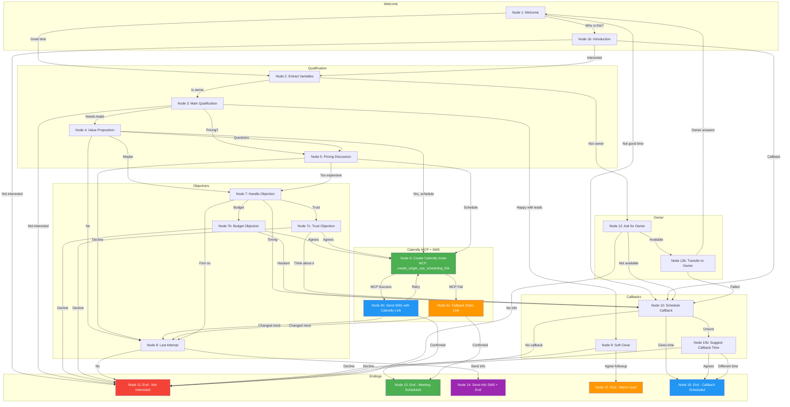

# Retell AI Conversation Flow Agent for GreenLine AI

## Agent Overview
- **Agent ID**: `ag...f47` (shown in your dashboard)
- **CF ID**: `co...a6c`
- **Cost**: $0.095/min
- **Latency**: 820-1000ms
- **Tokens**: 49-249 per interaction

---

## Node Components Available

| Node Type | Purpose |
|-----------|---------|
| **Conversation** | Main dialogue nodes with AI speaking/listening |
| **Transition** | Silent routing without AI speaking, just passes control |
| **Function** | Execute custom functions |
| **Call Transfer** | Transfer to human agent |
| **Press Digit** | IVR-style inputs |
| **Logic Split Node** | Conditional branching based on conditions |
| **Agent Transfer** | Switch between agents |
| **SMS** | Send text messages (static prompt only - no variable interpolation) |
| **Extract Variable** | Capture user information |
| **MCP** | Model Context Protocol integration (connects to external services) |
| **Ending** | End call with disposition |

---

## MCP Integration: Calendly

### MCP Server Configuration
**Your Calendly MCP URL**:
```
https://mcp.composio.dev/partner/composio/calendly/mcp?customerId=5b0a9a5c-4048-4a0f-a804-8ab38276513b
```

Alternative options:
- **Zapier**: `https://zapier.com/mcp/calendly` (easy setup)
- **Universal MCP**: `https://github.com/universal-mcp/calendly` (self-hosted)

### Calendly MCP Tools Available
| Tool | Purpose |
|------|---------|
| `get_current_user` | Get authenticated Calendly user info |
| `create_scheduling_link` | Create a booking link for an event type |
| `create_single_use_scheduling_link` | Create one-time use booking link |
| `get_event` | Get scheduled event details |
| `cancel_event` | Cancel a scheduled event |
| `get_event_invitee` | Get invitee details for an event |
| `create_invitee_no_show` | Mark invitee as no-show |
| `create_webhook_subscription` | Subscribe to Calendly events |

### Required Environment Variables
```
CALENDLY_ACCESS_TOKEN=your_personal_access_token
# OR OAuth:
CALENDLY_CLIENT_ID=your_client_id
CALENDLY_CLIENT_SECRET=your_client_secret
```

---

## SMS Limitations in Retell AI

**Important**: The SMS node in Retell AI is **static** - it only accepts a prompt/message and does NOT support variable interpolation like `{{owner_name}}` or `{{business_name}}`.

### Workarounds

1. **Use MCP + Function Node**:
   - Use MCP to generate dynamic content (like Calendly links)
   - Use a Function node to construct the SMS message with variables
   - Pass the constructed message to the SMS node

2. **Use Static Messages**:
   - Keep SMS content generic without personalization
   - Example: "Here's your booking link: [URL]"

3. **Use External SMS Service**:
   - Use a Function node to call an external API (Twilio, etc.)
   - This allows full control over message content with variables

### Recommended Flow for Dynamic SMS
```
[Extract Variables] → [MCP: Create Calendly Link] → [Function: Build SMS] → [SMS: Send]
```

---

## Complete Call Flow

---

### Node 1: Welcome Node
**Node Type**: Conversation (Static Sentence)

**Prompt**:
```
Hi there! This is Alex calling from GreenLine AI, a marketing agency. I hope you're doing well today!
Is now a good time to chat, or should I call back at a better time?
```

#### Transition
| Condition | Next Node |
|-----------|-----------|
| User says yes, now is good, they have time | → Node 2: Extract Variables |
| User says no, busy, not a good time | → Node 10: Schedule Callback |
| User asks who is calling or wants more info | → Node 1b: Introduction |

---

### Node 1b: Introduction (Optional)
**Node Type**: Conversation

**Prompt**:
```
Of course! My name is Alex and I'm reaching out from GreenLine AI.
We help home service businesses get more qualified leads through AI-powered marketing.
Is this something you have a few minutes to hear about?
```

#### Transition
| Condition | Next Node |
|-----------|-----------|
| User agrees to hear more | → Node 2: Extract Variables |
| User declines or not interested | → Node 11: End Call - Not Interested |
| User requests callback | → Node 10: Schedule Callback |

---

### Node 2: Extract Variables
**Node Type**: Extract Variable

**Prompt**:
```
Perfect! Before we dive in, I just want to make sure I have the right info.
Am I speaking with the business owner?
```

#### Variables
| Variable Name | Description | Type |
|---------------|-------------|------|
| `owner_name` | Extract the name of the person on the call. Listen for when they introduce themselves or mention their name. | Text |
| `business_name` | Extract the name of their business if mentioned in conversation. | Text |
| `is_owner` | Determine if the person is the business owner. Extract "yes" if they confirm ownership, "no" if they are an employee or manager. | Boolean |
| `business_type` | Extract the type of business they operate (e.g., plumbing, HVAC, roofing, tree service, landscaping). | Text |
| `current_marketing` | Extract any information about their current marketing methods or lead generation sources. | Text |

#### Transition
| Condition | Next Node |
|-----------|-----------|
| User confirms they are the owner | → Node 3: Main Qualification |
| User says they are not the owner | → Node 12: Ask for Owner |
| User is unsure or evasive | → Node 3: Main Qualification |

---

### Node 3: Main Qualification
**Node Type**: Conversation

**Prompt**:
```
Great to meet you, {{owner_name}}! I'll keep this super brief.
We help home services businesses like yours get more qualified leads.
Are you currently happy with the number of leads you're getting?
```

#### Variables
| Variable Name | Description | Type |
|---------------|-------------|------|
| `lead_satisfaction` | Extract the user's satisfaction level with their current leads. Options: "satisfied", "unsatisfied", "neutral". | Text |
| `pain_points` | Extract any specific complaints or challenges they mention about getting leads or customers. | Text |
| `monthly_leads` | If mentioned, extract how many leads or calls they currently receive per month. | Number |

#### Transition
| Condition | Next Node |
|-----------|-----------|
| User says no, could be better, needs more leads | → Node 4: Value Proposition |
| User says yes, happy, getting enough leads | → Node 9: Soft Close |
| User says not interested or asks to stop | → Node 11: End Call - Not Interested |
| User asks about pricing or cost | → Node 5: Pricing Discussion |

---

### Node 4: Value Proposition
**Node Type**: Conversation

**Prompt**:
```
I hear that a lot. Many {{business_type}} businesses struggle to get consistent,
quality leads. We specialize in AI-powered outreach and targeted marketing.
We've helped similar businesses increase their lead flow by 2-3x.

Would you be open to a quick 15-minute strategy call to see if we can help
your business grow?
```

#### Variables
| Variable Name | Description | Type |
|---------------|-------------|------|
| `meeting_interest` | Extract if the user is interested in scheduling a meeting. Options: "yes", "no", "maybe". | Text |
| `objection` | If they raise a concern or objection, extract what it is (e.g., "too expensive", "tried before", "no time"). | Text |

#### Transition
| Condition | Next Node |
|-----------|-----------|
| User agrees to schedule, says yes or sure | → Node 6: Create Calendly Invite (MCP) |
| User says maybe, needs to think about it | → Node 7: Handle Objection |
| User says no, not interested | → Node 8: Last Attempt |
| User asks questions about the service | → Node 5: Pricing Discussion |

---

### Node 5: Pricing Discussion
**Node Type**: Conversation

**Prompt**:
```
Great question! Our pricing depends on your specific needs and goals.
Generally, clients invest between $500-2000 per month, and most see a
3-5x return on that investment within the first 90 days.

The best way to give you an accurate picture is during a quick strategy
call where we can look at your specific situation. Would you be open to
scheduling 15 minutes to discuss?
```

#### Variables
| Variable Name | Description | Type |
|---------------|-------------|------|
| `budget_concern` | Extract if price is a concern. Listen for phrases like "too expensive", "can't afford", "tight budget". | Boolean |
| `budget_range` | If they mention a specific budget or what they currently spend on marketing, extract that amount. | Text |

#### Transition
| Condition | Next Node |
|-----------|-----------|
| User agrees to schedule a call | → Node 6: Create Calendly Invite (MCP) |
| User says too expensive or budget concerns | → Node 7: Handle Objection |
| User declines | → Node 8: Last Attempt |

---

### Node 6: Create Calendly Invite (MCP)
**Node Type**: MCP (Calendly)

**MCP URL**: `https://mcp.composio.dev/partner/composio/calendly/mcp?customerId=5b0a9a5c-4048-4a0f-a804-8ab38276513b`

**MCP Tool**: `create_single_use_scheduling_link`

**MCP Request Parameters** (key-value):
| Key | Value |
|-----|-------|
| `max_event_count` | `1` |
| `owner_type` | `User` |
| `owner` | `https://api.calendly.com/users/YOUR_USER_UUID` |

**MCP Response Variables** (key-value):
| Key | Description | Example Value |
|-----|-------------|---------------|
| `booking_url` | The single-use scheduling link to share | `https://calendly.com/d/abc-123-xyz/greenlineai` |
| `owner` | The Calendly user URI | `https://api.calendly.com/users/YOUR_USER_UUID` |
| `owner_type` | Type of owner | `User` |
| `max_event_count` | Max bookings allowed | `1` |
| `resource.uri` | Full resource URI | `https://api.calendly.com/scheduling_links/...` |

**Output Variable Mapping**:
| Response Key | Store As Variable |
|--------------|-------------------|
| `booking_url` | `calendly_booking_url` |

#### Transition
| Condition | Next Node |
|-----------|-----------|
| MCP returns scheduling link successfully | → Node 6b: Send SMS with Calendly Link |
| MCP fails | → Node 6c: Fallback - Static Calendly Link |

---

### Node 6b: Send SMS with Calendly Link
**Node Type**: SMS + Conversation

**Prompt**:
```
Excellent! I'm sending you a text right now with a link to book a time
that works best for you. You should receive it in just a second.

Is there anything specific you'd like us to cover during that call?
```

**SMS Content** (Note: SMS in Retell is static - use Function node to build dynamic content):
```
Hi! Here's the link to schedule your GreenLine AI strategy call: {{calendly_booking_url}}

Looking forward to helping your business grow!
```

#### Variables
| Variable Name | Description | Type |
|---------------|-------------|------|
| `meeting_topics` | Extract any specific topics or questions they want to discuss during the strategy call. | Text |
| `sms_confirmed` | Confirm if user received the SMS. Extract "yes" if they confirm receipt. | Boolean |

#### Transition
| Condition | Next Node |
|-----------|-----------|
| User confirms or has no questions | → Node 13: End Call - Meeting Scheduled |
| User didn't receive SMS or asks to resend | → Node 6: Create Calendly Invite (retry) |
| User changes mind | → Node 8: Last Attempt |

---

### Node 6c: Fallback - Static Calendly Link
**Node Type**: SMS + Conversation

**Purpose**: Fallback if MCP fails - sends the static Calendly URL

**Prompt**:
```
I'm sending you a text right now with our scheduling link.
You should receive it in just a moment!

Is there anything specific you'd like us to cover during that call?
```

**SMS Content**:
```
Hi! Book your GreenLine AI strategy call here: https://calendly.com/greenlineai

Looking forward to helping your business grow!
```

#### Transition
| Condition | Next Node |
|-----------|-----------|
| User confirms | → Node 13: End Call - Meeting Scheduled |
| User didn't receive SMS | → Node 6c: Fallback (retry once) |
| User changes mind | → Node 8: Last Attempt |

---

### Node 7: Handle Objection
**Node Type**: Conversation

**Prompt**:
```
I totally understand. A lot of business owners feel the same way at first.
Can I ask what's holding you back? Is it timing, budget, or something else?

I want to make sure I can address any concerns you might have.
```

#### Variables
| Variable Name | Description | Type |
|---------------|-------------|------|
| `objection_type` | Categorize the objection: "timing", "budget", "trust", "competition", "not_needed", "other". | Text |
| `objection_details` | Extract the specific details of their concern in their own words. | Text |

#### Transition
| Condition | Next Node |
|-----------|-----------|
| Objection is timing - too busy right now | → Node 10: Schedule Callback |
| Objection is budget - can't afford it | → Node 7b: Budget Objection Response |
| Objection is trust - tried before and failed | → Node 7c: Trust Objection Response |
| User remains firm on no | → Node 8: Last Attempt |

---

### Node 7b: Budget Objection Response
**Node Type**: Conversation

**Prompt**:
```
I completely understand budget is important. Here's the thing - our clients
typically see a positive ROI within the first month. We're not an expense,
we're an investment that pays for itself.

What if I could show you exactly how much revenue we could generate for
{{business_name}}? Would a no-obligation strategy call be worth 15 minutes
of your time?
```

#### Transition
| Condition | Next Node |
|-----------|-----------|
| User agrees to the call | → Node 6: Create Calendly Invite (MCP) |
| User still hesitant | → Node 10: Schedule Callback |
| User firmly declines | → Node 11: End Call - Not Interested |

---

### Node 7c: Trust Objection Response
**Node Type**: Conversation

**Prompt**:
```
That's a fair concern. A lot of marketing companies over-promise and under-deliver.
What makes us different is we use AI to target people who are actively looking
for {{business_type}} services in your area.

We also don't lock you into long contracts - if we're not delivering results,
you can cancel anytime. Would you be open to at least hearing how it works?
```

#### Transition
| Condition | Next Node |
|-----------|-----------|
| User agrees to learn more | → Node 6: Create Calendly Invite (MCP) |
| User wants to think about it | → Node 10: Schedule Callback |
| User firmly declines | → Node 11: End Call - Not Interested |

---

### Node 8: Last Attempt
**Node Type**: Conversation

**Prompt**:
```
No problem at all, I appreciate your time. Before I let you go - would it
be okay if I sent you a quick text with some information about what we do?

That way if you ever need help with leads in the future, you'll have our info handy.
```

#### Variables
| Variable Name | Description | Type |
|---------------|-------------|------|
| `info_consent` | Extract if user consents to receiving informational SMS. "yes" or "no". | Boolean |

#### Transition
| Condition | Next Node |
|-----------|-----------|
| User agrees to receive info | → Node 14: Send Info SMS + End |
| User declines | → Node 11: End Call - Not Interested |

---

### Node 9: Soft Close
**Node Type**: Conversation

**Prompt**:
```
That's great to hear that business is going well! We love to hear success stories.
Would you be open to me following up in a few months in case your lead flow
ever slows down?

That way you'll have a resource ready if you ever need help scaling.
```

#### Variables
| Variable Name | Description | Type |
|---------------|-------------|------|
| `followup_consent` | Extract if user agrees to future follow-up contact. | Boolean |
| `followup_timeframe` | If they mention a specific time to follow up, extract it (e.g., "3 months", "next quarter", "after summer"). | Text |

#### Transition
| Condition | Next Node |
|-----------|-----------|
| User agrees to follow-up | → Node 15: End Call - Warm Lead |
| User declines follow-up | → Node 11: End Call - Not Interested |

---

### Node 10: Schedule Callback
**Node Type**: Conversation + Extract Variable

**Prompt**:
```
No problem! When would be a better time for me to give you a call back?
I want to make sure I catch you when you have a few minutes.
```

#### Variables
| Variable Name | Description | Type |
|---------------|-------------|------|
| `callback_date` | Extract the date they want to be called back. Format: YYYY-MM-DD if possible, otherwise store as mentioned (e.g., "tomorrow", "next Tuesday"). | Text |
| `callback_time` | Extract the preferred time for callback. Format: HH:MM if possible, otherwise store as mentioned (e.g., "morning", "after 2pm"). | Text |
| `callback_timezone` | If mentioned, extract their timezone. Otherwise default to the business location timezone. | Text |

#### Transition
| Condition | Next Node |
|-----------|-----------|
| User provides callback time | → Node 16: End Call - Callback Scheduled |
| User says don't call back | → Node 11: End Call - Not Interested |
| User is unsure about time | → Node 10b: Suggest Callback Time |

---

### Node 10b: Suggest Callback Time
**Node Type**: Conversation

**Prompt**:
```
How about I give you a call back tomorrow around the same time?
Or would a morning or afternoon work better for you?
```

#### Transition
| Condition | Next Node |
|-----------|-----------|
| User agrees to suggested time | → Node 16: End Call - Callback Scheduled |
| User provides different time | → Node 16: End Call - Callback Scheduled |
| User declines callback | → Node 11: End Call - Not Interested |

---

### Node 11: End Call - Not Interested
**Node Type**: Ending

**Prompt**:
```
I completely understand. Thanks so much for your time today, and I hope
you have a wonderful rest of your day. Take care!
```

**Call Disposition**: Not Interested

#### Transition
| Condition | Next Node |
|-----------|-----------|
| (End of call) | — |

---

### Node 12: Ask for Owner
**Node Type**: Conversation

**Prompt**:
```
No problem! Is the owner available right now, or would it be better if I
called back at another time to speak with them?
```

#### Variables
| Variable Name | Description | Type |
|---------------|-------------|------|
| `owner_available` | Extract if the owner is available to take the call now. | Boolean |
| `owner_name` | If they mention the owner's name, extract it for future reference. | Text |
| `best_time_for_owner` | If they suggest a better time to reach the owner, extract that information. | Text |

#### Transition
| Condition | Next Node |
|-----------|-----------|
| Owner is available now | → Node 12b: Transfer to Owner |
| Owner not available, suggests callback time | → Node 10: Schedule Callback |
| They don't want to provide info | → Node 11: End Call - Not Interested |

---

### Node 12b: Transfer to Owner
**Node Type**: Conversation

**Prompt**:
```
Perfect! I'll hold while you transfer me. Thank you so much for your help!
```

#### Transition
| Condition | Next Node |
|-----------|-----------|
| Owner gets on the line | → Node 1: Welcome Node |
| Transfer fails or owner unavailable | → Node 10: Schedule Callback |

---

### Node 13: End Call - Meeting Scheduled
**Node Type**: Ending

**Prompt**:
```
Awesome! We're all set. You should have that link in your texts now.
I'm really looking forward to showing you how we can help {{business_name}} grow.

Have a great rest of your day, {{owner_name}}!
```

**Call Disposition**: Meeting Scheduled

#### Transition
| Condition | Next Node |
|-----------|-----------|
| (End of call) | — |

---

### Node 14: Send Info SMS + End
**Node Type**: SMS + Ending

**Prompt**:
```
Perfect, I just sent that over. If you ever have questions or want to
chat about growing your business, just reply to that text.
Thanks for your time today!
```

**SMS Content** (static - no variable interpolation in Retell SMS):
```
Thanks for chatting with GreenLine AI today!

When you're ready to get more leads, we're here to help:
https://greenline-ai.com

Reply anytime with questions!
```

**Call Disposition**: Info Sent - Follow Up Later

#### Transition
| Condition | Next Node |
|-----------|-----------|
| (End of call) | — |

---

### Node 15: End Call - Warm Lead
**Node Type**: Ending

**Prompt**:
```
Sounds great! I'll make a note to check back in with you. Keep up the
great work with {{business_name}}, and I hope your success continues!

Have a wonderful day!
```

**Call Disposition**: Warm Lead - Follow Up Later

#### Transition
| Condition | Next Node |
|-----------|-----------|
| (End of call) | — |

---

### Node 16: End Call - Callback Scheduled
**Node Type**: Ending

**Prompt**:
```
Perfect! I've got you down for {{callback_date}} at {{callback_time}}.
I'll give you a call then. Thanks so much for your time, and talk to you soon!
```

**Call Disposition**: Callback Scheduled

#### Transition
| Condition | Next Node |
|-----------|-----------|
| (End of call) | — |

---

## Global Variables (Passed from CRM)

These variables are injected into the call from your GreenLine AI dashboard:

| Variable Name | Description | Type | Example |
|---------------|-------------|------|---------|
| `business_name` | The name of the business being called. Use this to personalize the conversation. | Text | "Mowbray Tree Services" |
| `owner_name` | The name of the business owner if known from CRM data. | Text | "John Mowbray" |
| `business_type` | The industry or service type of the business. Use for relevant value propositions. | Text | "tree service" |
| `city` | The city where the business is located. | Text | "San Bernardino" |
| `state` | The state where the business is located. | Text | "CA" |
| `phone` | The business phone number being called. | Text | "(909) 389-0077" |
| `rating` | Google/Yelp rating if available. Can be used to customize approach. | Number | 3.5 |
| `review_count` | Number of online reviews. Businesses with few reviews may need different messaging. | Number | 133 |

---

## Call Dispositions Summary

| Disposition | When to Use | Follow-up Action |
|-------------|-------------|------------------|
| **Meeting Scheduled** | User agreed to strategy call, sent Calendly | Monitor for booking, follow up if no booking in 48h |
| **Callback Scheduled** | User requested specific callback time | Call at scheduled time |
| **Warm Lead - Follow Up Later** | User happy now but open to future contact | Follow up in 3-6 months |
| **Info Sent - Follow Up Later** | Sent info SMS, user may convert later | Follow up in 2-4 weeks |
| **Not Interested** | User clearly declined | No immediate follow-up |
| **Do Not Contact** | User requested removal from list | Remove from all campaigns |
| **Wrong Number** | Number doesn't belong to business | Update CRM data |
| **Voicemail** | Reached voicemail | Retry in 24-48 hours |

---

## Implementation Checklist

- [ ] Create all nodes in Retell dashboard (16 base + 2 new: 6b, 6c)
- [ ] Configure Calendly MCP server (Composio recommended)
- [ ] Set up `CALENDLY_ACCESS_TOKEN` environment variable
- [ ] Configure MCP node (Node 6) with Calendly tool
- [ ] Configure transitions between each node
- [ ] Add Extract Variable nodes with proper descriptions
- [ ] Set up SMS nodes (static content only - no variables)
- [ ] Configure CRM variable pass-through
- [ ] Test MCP → SMS flow for Calendly booking
- [ ] Test fallback flow when MCP fails
- [ ] Test all conversation paths
- [ ] Deploy and monitor performance

---

## Integration Code Reference

The `/functions/api/calls/initiate.ts` sends:

```typescript
POST https://api.retellai.com/v2/create-phone-call
{
  "from_number": null,
  "to_number": "(909) 389-0077",
  "agent_id": "ag...f47",
  "metadata": {
    "leadId": "lead-123",
    "campaignId": "campaign-456"
  },
  "retell_llm_dynamic_variables": {
    "business_name": "Mowbray Tree Services",
    "business_type": "tree service",
    "owner_name": "John",
    "city": "San Bernardino",
    "state": "CA"
  }
}
```

---

## Flow Diagram (Mermaid)



### Legend

| Color | Meaning |
|-------|---------|
| 🟢 Green | Success paths (MCP, Meeting Scheduled) |
| 🔵 Blue | SMS/Callback nodes |
| 🟠 Orange | Fallback/Warm lead paths |
| 🟣 Purple | Info sent |
| 🔴 Red | Not interested/End |
