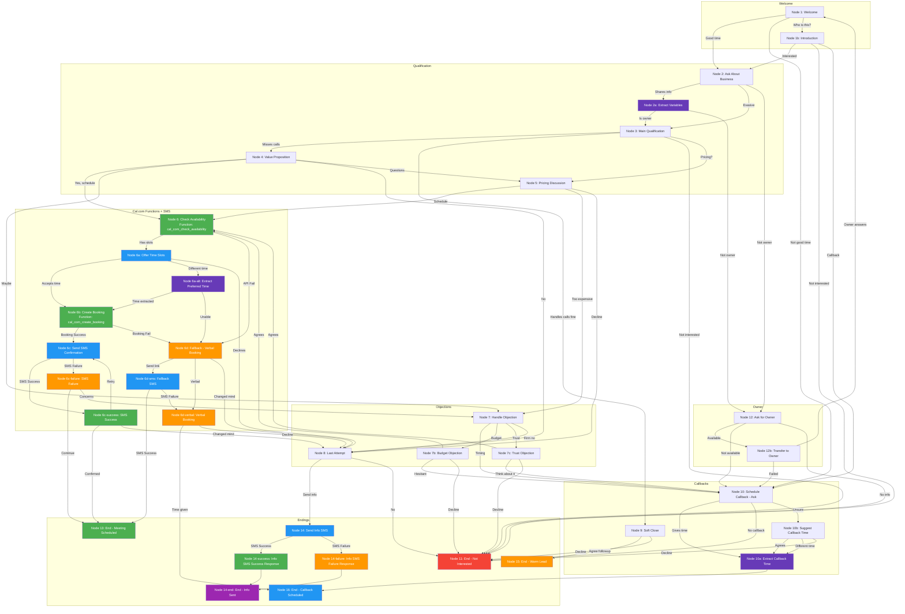

# Retell AI Conversation Flow Agent for GreenLine AI

## Agent Overview
- **Agent ID**: `ag...f47` (shown in your dashboard)
- **CF ID**: `co...a6c`
- **Cost**: $0.095/min
- **Latency**: 820-1000ms
- **Tokens**: 49-249 per interaction

---

## Node Components Available

| Node Type | Purpose | Content Mode |
|-----------|---------|--------------|
| **Conversation** | Main dialogue nodes with AI speaking/listening | 📝 Prompt OR Static |
| **Transition** | Silent routing without AI speaking, just passes control | N/A |
| **Function** | Execute custom functions (e.g., Cal.com booking) | N/A |
| **Call Transfer** | Transfer to human agent | 📝 Prompt OR Static |
| **Press Digit** | IVR-style inputs | 📝 Prompt OR Static |
| **Logic Split Node** | Conditional branching based on conditions | N/A |
| **Agent Transfer** | Switch between agents | N/A |
| **SMS** | Send text messages with success/failure transitions | 📝 Prompt OR Static (for response nodes) |
| **Extract Variable** | Capture user information | 📝 Prompt OR Static |
| **Ending** | End call with disposition | 📝 Prompt OR Static |

### Content Mode Legend

| Mode | Description |
|------|-------------|
| **Prompt** | AI generates dynamic response based on context and variables |
| **Static** | Pre-defined text spoken exactly as written |

---

## Function Node Integration: Cal.com

### Why Cal.com Function Node?
The built-in Function Node with Cal.com is **easier to configure** than MCP integrations:
- No external MCP server setup required
- Built-in Retell function - just configure and use
- Direct API integration with Cal.com
- Reliable success/failure transitions

### Function Node Configuration

**Function Name**: `cal_com_create_booking`

**Parameters**:
| Parameter | Description | Type |
|-----------|-------------|------|
| `event_type_id` | Your Cal.com event type ID | String |
| `attendee_name` | Lead's name (from variables) | String |
| `attendee_email` | Lead's email address | String |
| `attendee_phone` | Lead's phone number | String |
| `start_time` | Selected appointment time (ISO 8601) | String |
| `timezone` | Lead's timezone | String |

**Example Configuration**:
```json
{
  "function": "cal_com_create_booking",
  "parameters": {
    "event_type_id": "your-event-type-id",
    "attendee_name": "{{owner_name}}",
    "attendee_email": "{{lead_email}}",
    "attendee_phone": "{{phone}}",
    "start_time": "{{selected_time}}",
    "timezone": "America/Los_Angeles"
  }
}
```

### Function Node Transitions

| Transition | Description | Next Action |
|------------|-------------|-------------|
| **Success** | Booking created successfully | Proceed to confirmation response node |
| **Failure** | Booking failed (API error, slot unavailable) | Route to fallback/error handling node |

### Required Environment Variables
```
CAL_COM_API_KEY=your_cal_com_api_key
CAL_COM_EVENT_TYPE_ID=your_event_type_id
```

---

## SMS Node Configuration

The SMS node sends text messages and supports **success/failure transitions** with configurable response nodes.

### SMS Node Transitions

| Transition | Description | Response Node |
|------------|-------------|---------------|
| **Success** | SMS delivered successfully | SMS Success Response (📝 Prompt OR Static) |
| **Failure** | SMS failed to send | SMS Failure Response (📝 Prompt OR Static) |

### Example SMS Flow

```
[SMS Node: Send Booking Link]
    ├── Success → [Conversation: "Great, I just sent you the link!"] (Prompt OR Static)
    └── Failure → [Conversation: "I had trouble sending the link, let me help you book now."] (Prompt OR Static)
```

### SMS Content Options

| Mode | Description |
|------|-------------|
| **Prompt** | AI generates SMS content based on context |
| **Static** | Pre-defined message sent exactly as written |

### SMS Limitations

**Note**: SMS content has limited variable interpolation. For dynamic content:

1. **Use Function Node first**:
   - Use a Function node to construct the SMS message with variables
   - Pass the constructed message to the SMS node

2. **Use Static Messages**:
   - Keep SMS content generic without personalization
   - Example: "Here's your booking link: https://cal.com/greenlineai"

### Recommended Flow for Booking SMS
```
[Function: Cal.com Create Booking] → [SMS: Send Confirmation] → Success/Failure Response Nodes
```

---

## Complete Call Flow

---

### Node 1: Welcome Node
**Node Type**: Conversation
**Content Mode**: Static

**Content**:
```
Hi there! This is Alex calling from GreenLine AI, a marketing agency. I hope you're doing well today!
Is now a good time to chat, or should I call back at a better time?
```

#### Transition
| Condition | Next Node | Type |
|-----------|-----------|------|
| User says yes, now is good, they have time | → Node 2: Ask About Business | Prompt |
| User says no, busy, not a good time | → Node 10: Schedule Callback | Prompt |
| User asks who is calling or wants more info | → Node 1b: Introduction | Prompt |

---

### Node 1b: Introduction (Optional)
**Node Type**: Conversation
**Content Mode**: Static

**Content**:
```
Of course! My name is Alex and I'm reaching out from GreenLine AI.
We help home service businesses get more qualified leads through AI-powered marketing.
Is this something you have a few minutes to hear about?
```

#### Transition
| Condition | Next Node | Type |
|-----------|-----------|------|
| User agrees to hear more | → Node 2: Ask About Business | Prompt |
| User declines or not interested | → Node 11: End Call - Not Interested | Prompt |
| User requests callback | → Node 10: Schedule Callback | Prompt |

---

### Node 2: Ask About Business
**Node Type**: Conversation
**Content Mode**: Static

**Content**:
```
Perfect! Before we dive in, I'd love to know a bit more about you.
Could you tell me your name and a little about your business?
```

#### Transition
| Condition | Next Node | Type |
|-----------|-----------|------|
| User provides information about themselves | → Node 2a: Extract Variables | Prompt |
| User refuses to share or is evasive | → Node 3: Main Qualification | Prompt |
| User says they are not the owner | → Node 12: Ask for Owner | Prompt |

---

### Node 2a: Extract Variables
**Node Type**: Extract Variable

**Purpose**: Silently extract information from the user's previous response about themselves and their business.

#### Variables
| Variable Name | Description | Type |
|---------------|-------------|------|
| `owner_name` | Extract the name of the person on the call. Listen for when they introduce themselves or mention their name. | Text |
| `business_name` | Extract the name of their business if mentioned in conversation. | Text |
| `is_owner` | Determine if the person is the business owner. Extract "yes" if they confirm ownership, "no" if they are an employee or manager. | Boolean |
| `business_type` | Extract the type of business they operate (e.g., plumbing, HVAC, roofing, tree service, landscaping). | Text |
| `current_marketing` | Extract any information about their current marketing methods or lead generation sources. | Text |

#### Transition
| Condition | Next Node | Type |
|-----------|-----------|------|
| `{{is_owner}} == "yes"` | → Node 3: Main Qualification | Equation |
| `{{is_owner}} == "no"` | → Node 12: Ask for Owner | Equation |
| Default | → Node 3: Main Qualification | Equation |

---

### Node 3: Main Qualification
**Node Type**: Conversation
**Content Mode**: Prompt

**Content**:
```
Great to meet you, {{owner_name}}! I'll keep this super brief.
We help {{business_type}} businesses like yours never miss a call again
with our AI phone answering service.

Do you ever have trouble keeping up with incoming calls, or find yourself
missing calls when you're out on jobs?
```

#### Transition
| Condition | Next Node | Type |
|-----------|-----------|------|
| User says yes, misses calls, has trouble | → Node 4: Value Proposition | Prompt |
| User says no, handles calls fine | → Node 9: Soft Close | Prompt |
| User says not interested or asks to stop | → Node 11: End Call - Not Interested | Prompt |
| User asks about pricing or cost | → Node 5: Pricing Discussion | Prompt |

---

### Node 4: Value Proposition
**Node Type**: Conversation
**Content Mode**: Prompt

**Content**:
```
I hear that a lot. Every missed call is potentially hundreds or even thousands
of dollars walking out the door.

Our AI phone agent answers your calls 24/7 - it sounds just like a real person,
books appointments, answers questions about your services, and even qualifies
leads before they ever reach you.

Would you be open to a quick 15-minute demo call so I can show you exactly
how it works for {{business_type}} businesses?
```

#### Transition
| Condition | Next Node | Type |
|-----------|-----------|------|
| User agrees to schedule, says yes or sure | → Node 6: Check Availability | Prompt |
| User says maybe, needs to think about it | → Node 7: Handle Objection | Prompt |
| User says no, not interested | → Node 8: Last Attempt | Prompt |
| User asks questions about the service | → Node 5: Pricing Discussion | Prompt |

---

### Node 5: Pricing Discussion
**Node Type**: Conversation
**Content Mode**: Static

**Content**:
```
Great question! Our AI phone agent starts at just $297 per month.
When you think about it, that's less than a single missed job could cost you.

Most of our clients tell us it pays for itself within the first week
just from the calls they would have missed.

The best way to see if it's right for you is a quick 15-minute demo
where I can show you exactly how it would work for {{business_name}}.
Would you be open to that?
```

#### Transition
| Condition | Next Node | Type |
|-----------|-----------|------|
| User agrees to schedule a call | → Node 6: Check Availability | Prompt |
| User says too expensive or budget concerns | → Node 7: Handle Objection | Prompt |
| User declines | → Node 8: Last Attempt | Prompt |

---

### Node 6: Check Availability (Function Node: Cal.com)
**Node Type**: Function
**Function**: `cal_com_check_availability`

**Purpose**: Check available time slots before asking the user to pick a time.

**Function Configuration**:
```json
{
  "function": "cal_com_check_availability",
  "parameters": {
    "event_type_id": "{{cal_event_type_id}}",
    "timezone": "America/Los_Angeles",
    "date_range": "next_7_days"
  }
}
```

**Response Variables**:
| Variable | Description |
|----------|-------------|
| `available_slots` | Array of available time slots |
| `next_available` | The next available slot |

#### Transition
| Condition | Next Node | Type |
|-----------|-----------|------|
| `{{available_slots}} != null` | → Node 6a: Offer Time Slots | Equation |
| `{{available_slots}} == null` | → Node 6c: Fallback - Verbal Booking | Equation |

---

### Node 6a: Offer Time Slots
**Node Type**: Conversation
**Content Mode**: Prompt

**Purpose**: Present available times to the user and let them choose.

**Content**:
```
I have some times available this week. How does {{next_available}} work for you?
Or if that doesn't work, I can find another time that fits your schedule.
```

#### Transition
| Condition | Next Node | Type |
|-----------|-----------|------|
| User agrees to the offered time | → Node 6b: Create Booking | Prompt |
| User requests a different time | → Node 6a-alt: Extract Preferred Time | Prompt |
| User changes mind or declines | → Node 8: Last Attempt | Prompt |

---

### Node 6a-alt: Extract Preferred Time
**Node Type**: Extract Variable

**Purpose**: Capture the user's preferred time if they didn't accept the first offer.

#### Variables
| Variable Name | Description | Type |
|---------------|-------------|------|
| `preferred_time` | The time the user requested (e.g., "Tuesday afternoon", "tomorrow morning") | Text |

#### Transition
| Condition | Next Node | Type |
|-----------|-----------|------|
| `{{preferred_time}} != ""` | → Node 6b: Create Booking | Equation |
| `{{preferred_time}} == ""` | → Node 6c: Fallback - Verbal Booking | Equation |

---

### Node 6b: Create Booking (Function Node: Cal.com)
**Node Type**: Function
**Function**: `cal_com_create_booking`

**Purpose**: Create the actual booking after user selects a time.

**Function Configuration**:
```json
{
  "function": "cal_com_create_booking",
  "parameters": {
    "event_type_id": "{{cal_event_type_id}}",
    "attendee_name": "{{owner_name}}",
    "attendee_email": "{{lead_email}}",
    "attendee_phone": "{{phone}}",
    "start_time": "{{selected_time}}",
    "timezone": "America/Los_Angeles"
  }
}
```

**Response Variables**:
| Variable | Description |
|----------|-------------|
| `booking_url` | Link to the booking confirmation |
| `booking_id` | Unique booking identifier |
| `confirmed_time` | The confirmed appointment time |

#### Transition
| Condition | Next Node | Type |
|-----------|-----------|------|
| `{{booking_id}} != null` | → Node 6c: Send SMS Confirmation | Equation |
| `{{booking_id}} == null` | → Node 6d: Fallback - Verbal Booking | Equation |

---

### Node 6c: Send SMS Confirmation
**Node Type**: SMS

**Purpose**: Send confirmation SMS after booking is created.

**SMS Content**:
```
Hi {{owner_name}}! Your GreenLine AI demo is confirmed for {{confirmed_time}}.

Looking forward to showing you how our AI phone agent can help {{business_name}}!
```

#### SMS Transitions (Built-in)
| Transition | Next Node |
|------------|-----------|
| **Success** | → Node 6c-success: SMS Success Response |
| **Failure** | → Node 6c-failure: SMS Failure Response |

---

### Node 6c-success: SMS Success Response
**Node Type**: Conversation
**Content Mode**: Static

**Content**:
```
Excellent! I just sent you a confirmation text. You should receive it in just a second.
Is there anything specific you'd like us to cover during that demo?
```

#### Transition
| Condition | Next Node | Type |
|-----------|-----------|------|
| User confirms or has no questions | → Node 13: End Call - Meeting Scheduled | Prompt |
| User didn't receive SMS or asks to resend | → Node 6c: Send SMS Confirmation (retry) | Prompt |
| User changes mind | → Node 8: Last Attempt | Prompt |

---

### Node 6c-failure: SMS Failure Response
**Node Type**: Conversation
**Content Mode**: Static

**Content**:
```
I had a little trouble sending the confirmation text, but no worries - you're all booked!
Your demo is set for {{confirmed_time}}. You'll receive an email confirmation shortly.
Is there anything specific you'd like us to cover during that call?
```

#### Transition
| Condition | Next Node | Type |
|-----------|-----------|------|
| User confirms | → Node 13: End Call - Meeting Scheduled | Prompt |
| User has concerns | → Node 7: Handle Objection | Prompt |

---

### Node 6d: Fallback - Verbal Booking
**Node Type**: Conversation
**Content Mode**: Static

**Purpose**: Fallback if Cal.com booking fails - offer to book verbally or send static link.

**Content**:
```
I'm having a little trouble with our booking system, but no worries!
Let me send you a text with our scheduling link so you can book at your convenience.
```

#### Transition
| Condition | Next Node | Type |
|-----------|-----------|------|
| User agrees to receive link | → Node 6d-sms: Send Fallback SMS | Prompt |
| User prefers verbal booking | → Node 6d-verbal: Verbal Booking | Prompt |
| User changes mind | → Node 8: Last Attempt | Prompt |

---

### Node 6d-sms: Send Fallback SMS
**Node Type**: SMS

**SMS Content**:
```
Hi! Book your GreenLine AI demo here: https://cal.com/greenlineai

Looking forward to showing you how our AI phone agent can help your business!
```

#### SMS Transitions (Built-in)
| Transition | Next Node |
|------------|-----------|
| **Success** | → Node 6d-sms-success: Fallback SMS Success |
| **Failure** | → Node 6d-verbal: Verbal Booking |

---

### Node 6d-sms-success: Fallback SMS Success
**Node Type**: Conversation
**Content Mode**: Static

**Content**:
```
I just sent that over. You can book a time that works best for you right from that link.
Is there anything else I can help you with?
```

#### Transition
| Condition | Next Node | Type |
|-----------|-----------|------|
| User confirms | → Node 13: End Call - Meeting Scheduled | Prompt |
| User has questions | → Node 7: Handle Objection | Prompt |

---

### Node 6d-verbal: Verbal Booking
**Node Type**: Conversation
**Content Mode**: Static

**Content**:
```
No problem! Let's do this the old-fashioned way.
What day this week or next works best for a quick 15-minute demo?
```

#### Transition
| Condition | Next Node | Type |
|-----------|-----------|------|
| User provides time | → Node 16: End Call - Callback Scheduled | Prompt |
| User declines | → Node 8: Last Attempt | Prompt |

---

### Node 7: Handle Objection
**Node Type**: Conversation
**Content Mode**: Prompt

**Content**:
```
I totally understand. A lot of business owners feel the same way at first.
Can I ask what's holding you back? Is it timing, budget, or something else?

I want to make sure I can address any concerns you might have.
```

#### Transition
| Condition | Next Node | Type |
|-----------|-----------|------|
| Objection is timing - too busy right now | → Node 10: Schedule Callback | Prompt |
| Objection is budget - can't afford it | → Node 7b: Budget Objection Response | Prompt |
| Objection is trust - tried before and failed | → Node 7c: Trust Objection Response | Prompt |
| User remains firm on no | → Node 8: Last Attempt | Prompt |

---

### Node 7b: Budget Objection Response
**Node Type**: Conversation
**Content Mode**: Prompt

**Content**:
```
I completely understand - every dollar counts when you're running a business.

Here's how I look at it: at $297 a month, if the AI agent books you just ONE
extra job that you would have missed, it's already paid for itself.

Most {{business_type}} jobs are what, $200, $500, maybe more? One saved call
and you're in the green. Would a quick 15-minute demo be worth seeing how
it could work for {{business_name}}?
```

#### Transition
| Condition | Next Node | Type |
|-----------|-----------|------|
| User agrees to the call | → Node 6: Check Availability | Prompt |
| User still hesitant | → Node 10: Schedule Callback | Prompt |
| User firmly declines | → Node 11: End Call - Not Interested | Prompt |

---

### Node 7c: Trust Objection Response
**Node Type**: Conversation
**Content Mode**: Prompt

**Content**:
```
That's a fair concern. A lot of tech solutions promise the world and don't deliver.

What makes our AI phone agent different is you can actually hear it in action
before you commit. It sounds like a real person - most callers can't tell the
difference.

And there's no long contract - if it's not working for you, you can cancel
anytime. Would you be open to just hearing a quick demo to see what it
sounds like?
```

#### Transition
| Condition | Next Node | Type |
|-----------|-----------|------|
| User agrees to learn more | → Node 6: Check Availability | Prompt |
| User wants to think about it | → Node 10: Schedule Callback | Prompt |
| User firmly declines | → Node 11: End Call - Not Interested | Prompt |

---

### Node 8: Last Attempt
**Node Type**: Conversation
**Content Mode**: Static

**Content**:
```
No problem at all, I appreciate your time. Before I let you go - would it
be okay if I sent you a quick text with some information about our AI phone agent?

That way if you ever find yourself missing calls, you'll have our info handy.
```

#### Transition
| Condition | Next Node | Type |
|-----------|-----------|------|
| User agrees to receive info | → Node 14: Send Info SMS + End | Prompt |
| User declines | → Node 11: End Call - Not Interested | Prompt |

---

### Node 9: Soft Close
**Node Type**: Conversation
**Content Mode**: Static

**Content**:
```
That's great to hear you're staying on top of your calls! We love to hear that.

Would you be open to me following up in a few months? A lot of business owners
find that as they grow, keeping up with calls gets harder.

That way you'll have a resource ready if you ever need help.
```

#### Transition
| Condition | Next Node | Type |
|-----------|-----------|------|
| User agrees to follow-up | → Node 15: End Call - Warm Lead | Prompt |
| User declines follow-up | → Node 11: End Call - Not Interested | Prompt |

---

### Node 10: Schedule Callback - Ask
**Node Type**: Conversation
**Content Mode**: Static

**Content**:
```
No problem! When would be a better time for me to give you a call back?
I want to make sure I catch you when you have a few minutes.
```

#### Transition
| Condition | Next Node | Type |
|-----------|-----------|------|
| User provides a date/time | → Node 10a: Extract Callback Time | Prompt |
| User says don't call back | → Node 11: End Call - Not Interested | Prompt |
| User is unsure about time | → Node 10b: Suggest Callback Time | Prompt |

---

### Node 10a: Extract Callback Time
**Node Type**: Extract Variable
**Content Mode**: Static

**Content**:
```
Got it, let me make a note of that.
```

#### Variables
| Variable Name | Description | Type |
|---------------|-------------|------|
| `callback_date` | Extract the date they want to be called back. Format: YYYY-MM-DD if possible, otherwise store as mentioned (e.g., "tomorrow", "next Tuesday"). | Text |
| `callback_time` | Extract the preferred time for callback. Format: HH:MM if possible, otherwise store as mentioned (e.g., "morning", "after 2pm"). | Text |

#### Transition
| Condition | Next Node | Type |
|-----------|-----------|------|
| `{{callback_date}} != "" AND {{callback_time}} != ""` | → Node 16: End Call - Callback Scheduled | Equation |

---

### Node 10b: Suggest Callback Time
**Node Type**: Conversation
**Content Mode**: Static

**Content**:
```
How about I give you a call back tomorrow around the same time?
Or would a morning or afternoon work better for you?
```

#### Transition
| Condition | Next Node | Type |
|-----------|-----------|------|
| User agrees to suggested time | → Node 10a: Extract Callback Time | Prompt |
| User provides different time | → Node 10a: Extract Callback Time | Prompt |
| User declines callback | → Node 11: End Call - Not Interested | Prompt |

---

### Node 11: End Call - Not Interested
**Node Type**: Ending
**Content Mode**: Static

**Content**:
```
I completely understand. Thanks so much for your time today, and I hope
you have a wonderful rest of your day. Take care!
```

**Call Disposition**: Not Interested

#### Transition
| Condition | Next Node | Type |
|-----------|-----------|------|
| (End of call) | — | — |

---

### Node 12: Ask for Owner
**Node Type**: Conversation
**Content Mode**: Static

**Content**:
```
No problem! Is the owner available right now, or would it be better if I
called back at another time to speak with them?
```

#### Transition
| Condition | Next Node | Type |
|-----------|-----------|------|
| Owner is available now | → Node 12b: Transfer to Owner | Prompt |
| Owner not available, suggests callback time | → Node 10: Schedule Callback | Prompt |
| They don't want to provide info | → Node 11: End Call - Not Interested | Prompt |

---

### Node 12b: Transfer to Owner
**Node Type**: Conversation
**Content Mode**: Static

**Content**:
```
Perfect! I'll hold while you transfer me. Thank you so much for your help!
```

#### Transition
| Condition | Next Node | Type |
|-----------|-----------|------|
| Owner gets on the line | → Node 1: Welcome Node | Prompt |
| Transfer fails or owner unavailable | → Node 10: Schedule Callback | Prompt |

---

### Node 13: End Call - Meeting Scheduled
**Node Type**: Ending
**Content Mode**: Prompt

**Content**:
```
Awesome! We're all set. You should have that link in your texts now.
I'm really looking forward to showing you how we can help {{business_name}} grow.

Have a great rest of your day, {{owner_name}}!
```

**Call Disposition**: Meeting Scheduled

#### Transition
| Condition | Next Node | Type |
|-----------|-----------|------|
| (End of call) | — | — |

---

### Node 14: Send Info SMS
**Node Type**: SMS

**SMS Content**:
```
Thanks for chatting with GreenLine AI today!

When you're ready to get more leads, we're here to help:
https://greenline-ai.com

Reply anytime with questions!
```

#### SMS Transitions (Built-in)
| Transition | Next Node |
|------------|-----------|
| **Success** | → Node 14-success: Info SMS Success Response |
| **Failure** | → Node 14-failure: Info SMS Failure Response |

---

### Node 14-success: Info SMS Success Response
**Node Type**: Conversation
**Content Mode**: Static

**Content**:
```
Perfect, I just sent that over. If you ever have questions or want to
chat about growing your business, just reply to that text.
Thanks for your time today!
```

#### Transition
| Condition | Next Node | Type |
|-----------|-----------|------|
| User says goodbye or confirms | → Node 14-end: End Call - Info Sent | Prompt |
| (Any response) | → Node 14-end: End Call - Info Sent | Prompt |

---

### Node 14-failure: Info SMS Failure Response
**Node Type**: Conversation
**Content Mode**: Static

**Content**:
```
I had a little trouble sending the text, but you can find us at greenline-ai.com anytime.
Thanks so much for your time today!
```

#### Transition
| Condition | Next Node | Type |
|-----------|-----------|------|
| User says goodbye or confirms | → Node 14-end: End Call - Info Sent | Prompt |
| (Any response) | → Node 14-end: End Call - Info Sent | Prompt |

---

### Node 14-end: End Call - Info Sent
**Node Type**: Ending
**Content Mode**: Static
**Call Disposition**: Info Sent - Follow Up Later

**Content**:
```
Take care!
```

#### Transition
| Condition | Next Node | Type |
|-----------|-----------|------|
| (End of call) | — | — |

---

### Node 15: End Call - Warm Lead
**Node Type**: Ending
**Content Mode**: Prompt

**Content**:
```
Sounds great! I'll make a note to check back in with you. Keep up the
great work with {{business_name}}, and I hope your success continues!

Have a wonderful day!
```

**Call Disposition**: Warm Lead - Follow Up Later

#### Transition
| Condition | Next Node | Type |
|-----------|-----------|------|
| (End of call) | — | — |

---

### Node 16: End Call - Callback Scheduled
**Node Type**: Ending
**Content Mode**: Prompt

**Content**:
```
Perfect! I've got you down for {{callback_date}} at {{callback_time}}.
I'll give you a call then. Thanks so much for your time, and talk to you soon!
```

**Call Disposition**: Callback Scheduled

#### Transition
| Condition | Next Node | Type |
|-----------|-----------|------|
| (End of call) | — | — |

---

## Global Variables (Passed from CRM)

These variables are injected into the call from your GreenLine AI dashboard:

| Variable Name | Description | Type | Example |
|---------------|-------------|------|---------|
| `business_name` | The name of the business being called. Use this to personalize the conversation. | Text | "Mowbray Tree Services" |
| `owner_name` | The name of the business owner if known from CRM data. | Text | "John Mowbray" |
| `business_type` | The industry or service type of the business. Use for relevant value propositions. | Text | "tree service" |
| `city` | The city where the business is located. | Text | "San Bernardino" |
| `state` | The state where the business is located. | Text | "CA" |
| `phone` | The business phone number being called. | Text | "(909) 389-0077" |
| `rating` | Google/Yelp rating if available. Can be used to customize approach. | Number | 3.5 |
| `review_count` | Number of online reviews. Businesses with few reviews may need different messaging. | Number | 133 |

---

## Call Dispositions Summary

| Disposition | When to Use | Follow-up Action |
|-------------|-------------|------------------|
| **Meeting Scheduled** | User agreed to strategy call, booked via Cal.com | Monitor for booking, follow up if no booking in 48h |
| **Callback Scheduled** | User requested specific callback time | Call at scheduled time |
| **Warm Lead - Follow Up Later** | User happy now but open to future contact | Follow up in 3-6 months |
| **Info Sent - Follow Up Later** | Sent info SMS, user may convert later | Follow up in 2-4 weeks |
| **Not Interested** | User clearly declined | No immediate follow-up |
| **Do Not Contact** | User requested removal from list | Remove from all campaigns |
| **Wrong Number** | Number doesn't belong to business | Update CRM data |
| **Voicemail** | Reached voicemail | Retry in 24-48 hours |

---

## Implementation Checklist

- [ ] Create all nodes in Retell dashboard (includes new SMS success/failure response nodes)
- [ ] Configure Cal.com Function Node (Node 6) with API key
- [ ] Set up `CAL_COM_API_KEY` environment variable
- [ ] Set up `CAL_COM_EVENT_TYPE_ID` environment variable
- [ ] Configure transitions between each node
- [ ] Add Extract Variable nodes with proper descriptions
- [ ] Set up SMS nodes with success/failure transitions
- [ ] Configure SMS response nodes (Prompt OR Static content)
- [ ] Configure CRM variable pass-through
- [ ] Test Function Node → SMS flow for Cal.com booking
- [ ] Test fallback flow when Function Node fails
- [ ] Test all conversation paths
- [ ] Deploy and monitor performance

---

## Integration Code Reference

The `/functions/api/calls/initiate.ts` sends:

```typescript
POST https://api.retellai.com/v2/create-phone-call
{
  "from_number": null,
  "to_number": "(909) 389-0077",
  "agent_id": "ag...f47",
  "metadata": {
    "leadId": "lead-123",
    "campaignId": "campaign-456"
  },
  "retell_llm_dynamic_variables": {
    "business_name": "Mowbray Tree Services",
    "business_type": "tree service",
    "owner_name": "John",
    "city": "San Bernardino",
    "state": "CA"
  }
}
```

---

## Flow Diagram (Mermaid)



### Legend

| Color | Meaning |
|-------|---------|
| 🟢 Green | Success paths (Function Node, Meeting Scheduled, SMS Success) |
| 🔵 Blue | SMS nodes/Callback nodes |
| 🟠 Orange | Fallback/Warm lead paths/SMS Failure |
| 🟣 Purple | Info sent |
| 🔴 Red | Not interested/End |
