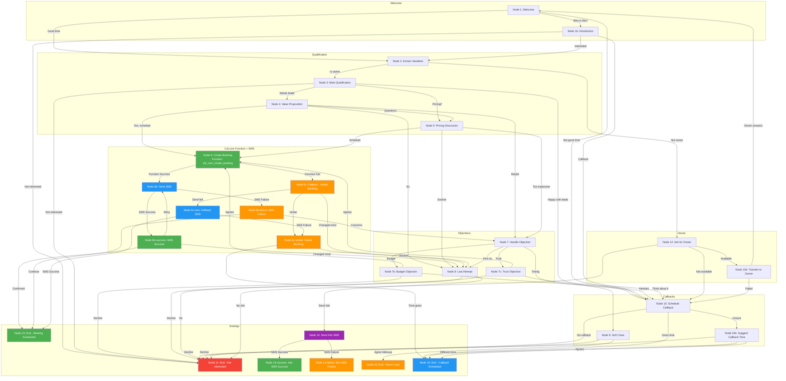

# Retell AI Conversation Flow Agent for GreenLine AI

## Agent Overview
- **Agent ID**: `ag...f47` (shown in your dashboard)
- **CF ID**: `co...a6c`
- **Cost**: $0.095/min
- **Latency**: 820-1000ms
- **Tokens**: 49-249 per interaction

---

## Node Components Available

| Node Type | Purpose | Content Mode |
|-----------|---------|--------------|
| **Conversation** | Main dialogue nodes with AI speaking/listening | 📝 Prompt OR Static |
| **Transition** | Silent routing without AI speaking, just passes control | N/A |
| **Function** | Execute custom functions (e.g., Cal.com booking) | N/A |
| **Call Transfer** | Transfer to human agent | 📝 Prompt OR Static |
| **Press Digit** | IVR-style inputs | 📝 Prompt OR Static |
| **Logic Split Node** | Conditional branching based on conditions | N/A |
| **Agent Transfer** | Switch between agents | N/A |
| **SMS** | Send text messages with success/failure transitions | 📝 Prompt OR Static (for response nodes) |
| **Extract Variable** | Capture user information | 📝 Prompt OR Static |
| **Ending** | End call with disposition | 📝 Prompt OR Static |

### Content Mode Legend

| Mode | Description |
|------|-------------|
| **Prompt** | AI generates dynamic response based on context and variables |
| **Static** | Pre-defined text spoken exactly as written |

---

## Function Node Integration: Cal.com

### Why Cal.com Function Node?
The built-in Function Node with Cal.com is **easier to configure** than MCP integrations:
- No external MCP server setup required
- Built-in Retell function - just configure and use
- Direct API integration with Cal.com
- Reliable success/failure transitions

### Function Node Configuration

**Function Name**: `cal_com_create_booking`

**Parameters**:
| Parameter | Description | Type |
|-----------|-------------|------|
| `event_type_id` | Your Cal.com event type ID | String |
| `attendee_name` | Lead's name (from variables) | String |
| `attendee_email` | Lead's email address | String |
| `attendee_phone` | Lead's phone number | String |
| `start_time` | Selected appointment time (ISO 8601) | String |
| `timezone` | Lead's timezone | String |

**Example Configuration**:
```json
{
  "function": "cal_com_create_booking",
  "parameters": {
    "event_type_id": "your-event-type-id",
    "attendee_name": "{{owner_name}}",
    "attendee_email": "{{lead_email}}",
    "attendee_phone": "{{phone}}",
    "start_time": "{{selected_time}}",
    "timezone": "America/Los_Angeles"
  }
}
```

### Function Node Transitions

| Transition | Description | Next Action |
|------------|-------------|-------------|
| **Success** | Booking created successfully | Proceed to confirmation response node |
| **Failure** | Booking failed (API error, slot unavailable) | Route to fallback/error handling node |

### Required Environment Variables
```
CAL_COM_API_KEY=your_cal_com_api_key
CAL_COM_EVENT_TYPE_ID=your_event_type_id
```

---

## SMS Node Configuration

The SMS node sends text messages and supports **success/failure transitions** with configurable response nodes.

### SMS Node Transitions

| Transition | Description | Response Node |
|------------|-------------|---------------|
| **Success** | SMS delivered successfully | SMS Success Response (📝 Prompt OR Static) |
| **Failure** | SMS failed to send | SMS Failure Response (📝 Prompt OR Static) |

### Example SMS Flow

```
[SMS Node: Send Booking Link]
    ├── Success → [Conversation: "Great, I just sent you the link!"] (Prompt OR Static)
    └── Failure → [Conversation: "I had trouble sending the link, let me help you book now."] (Prompt OR Static)
```

### SMS Content Options

| Mode | Description |
|------|-------------|
| **Prompt** | AI generates SMS content based on context |
| **Static** | Pre-defined message sent exactly as written |

### SMS Limitations

**Note**: SMS content has limited variable interpolation. For dynamic content:

1. **Use Function Node first**:
   - Use a Function node to construct the SMS message with variables
   - Pass the constructed message to the SMS node

2. **Use Static Messages**:
   - Keep SMS content generic without personalization
   - Example: "Here's your booking link: https://cal.com/greenlineai"

### Recommended Flow for Booking SMS
```
[Function: Cal.com Create Booking] → [SMS: Send Confirmation] → Success/Failure Response Nodes
```

---

## Complete Call Flow

---

### Node 1: Welcome Node
**Node Type**: Conversation
**Content Mode**: Static

**Content**:
```
Hi there! This is Alex calling from GreenLine AI, a marketing agency. I hope you're doing well today!
Is now a good time to chat, or should I call back at a better time?
```

#### Transition
| Condition | Next Node |
|-----------|-----------|
| User says yes, now is good, they have time | → Node 2: Extract Variables |
| User says no, busy, not a good time | → Node 10: Schedule Callback |
| User asks who is calling or wants more info | → Node 1b: Introduction |

---

### Node 1b: Introduction (Optional)
**Node Type**: Conversation
**Content Mode**: Static

**Content**:
```
Of course! My name is Alex and I'm reaching out from GreenLine AI.
We help home service businesses get more qualified leads through AI-powered marketing.
Is this something you have a few minutes to hear about?
```

#### Transition
| Condition | Next Node |
|-----------|-----------|
| User agrees to hear more | → Node 2: Extract Variables |
| User declines or not interested | → Node 11: End Call - Not Interested |
| User requests callback | → Node 10: Schedule Callback |

---

### Node 2: Extract Variables
**Node Type**: Extract Variable
**Content Mode**: Static

**Content**:
```
Perfect! Before we dive in, I just want to make sure I have the right info.
Am I speaking with the business owner?
```

#### Variables
| Variable Name | Description | Type |
|---------------|-------------|------|
| `owner_name` | Extract the name of the person on the call. Listen for when they introduce themselves or mention their name. | Text |
| `business_name` | Extract the name of their business if mentioned in conversation. | Text |
| `is_owner` | Determine if the person is the business owner. Extract "yes" if they confirm ownership, "no" if they are an employee or manager. | Boolean |
| `business_type` | Extract the type of business they operate (e.g., plumbing, HVAC, roofing, tree service, landscaping). | Text |
| `current_marketing` | Extract any information about their current marketing methods or lead generation sources. | Text |

#### Transition
| Condition | Next Node |
|-----------|-----------|
| User confirms they are the owner | → Node 3: Main Qualification |
| User says they are not the owner | → Node 12: Ask for Owner |
| User is unsure or evasive | → Node 3: Main Qualification |

---

### Node 3: Main Qualification
**Node Type**: Conversation
**Content Mode**: Prompt

**Content**:
```
Great to meet you, {{owner_name}}! I'll keep this super brief.
We help home services businesses like yours get more qualified leads.
Are you currently happy with the number of leads you're getting?
```

#### Transition
| Condition | Next Node |
|-----------|-----------|
| User says no, could be better, needs more leads | → Node 4: Value Proposition |
| User says yes, happy, getting enough leads | → Node 9: Soft Close |
| User says not interested or asks to stop | → Node 11: End Call - Not Interested |
| User asks about pricing or cost | → Node 5: Pricing Discussion |

---

### Node 4: Value Proposition
**Node Type**: Conversation
**Content Mode**: Prompt

**Content**:
```
I hear that a lot. Many {{business_type}} businesses struggle to get consistent,
quality leads. We specialize in AI-powered outreach and targeted marketing.
We've helped similar businesses increase their lead flow by 2-3x.

Would you be open to a quick 15-minute strategy call to see if we can help
your business grow?
```

#### Transition
| Condition | Next Node |
|-----------|-----------|
| User agrees to schedule, says yes or sure | → Node 6: Create Calendly Invite (MCP) |
| User says maybe, needs to think about it | → Node 7: Handle Objection |
| User says no, not interested | → Node 8: Last Attempt |
| User asks questions about the service | → Node 5: Pricing Discussion |

---

### Node 5: Pricing Discussion
**Node Type**: Conversation
**Content Mode**: Static

**Content**:
```
Great question! Our pricing depends on your specific needs and goals.
Generally, clients invest between $500-2000 per month, and most see a
3-5x return on that investment within the first 90 days.

The best way to give you an accurate picture is during a quick strategy
call where we can look at your specific situation. Would you be open to
scheduling 15 minutes to discuss?
```

#### Transition
| Condition | Next Node |
|-----------|-----------|
| User agrees to schedule a call | → Node 6: Create Calendly Invite (MCP) |
| User says too expensive or budget concerns | → Node 7: Handle Objection |
| User declines | → Node 8: Last Attempt |

---

### Node 6: Create Booking (Function Node: Cal.com)
**Node Type**: Function
**Function**: `cal_com_create_booking`

**Function Configuration**:
```json
{
  "function": "cal_com_create_booking",
  "parameters": {
    "event_type_id": "{{cal_event_type_id}}",
    "attendee_name": "{{owner_name}}",
    "attendee_email": "{{lead_email}}",
    "attendee_phone": "{{phone}}",
    "start_time": "{{selected_time}}",
    "timezone": "America/Los_Angeles"
  }
}
```

**Response Variables** (needs testing):
> The Function Node may return booking details automatically. Test to confirm if these variables are available:

| Key | Value |
|-----|-------|
| `booking_url` | `{{cal_booking_url}}` |
| `booking_id` | `{{cal_booking_id}}` |
| `start_time` | `{{cal_start_time}}` |

> If response variables are not available, use a static Cal.com scheduling link in the SMS node.

#### Transition
| Condition | Next Node |
|-----------|-----------|
| Function returns booking successfully | → Node 6b: Send SMS with Booking Link |
| Function fails (API error, slot unavailable) | → Node 6c: Fallback - Verbal Booking |

---

### Node 6b: Send SMS with Booking Link
**Node Type**: SMS

**SMS Content**:
```
Hi! Here's the link to book your GreenLine AI strategy call: https://cal.com/greenlineai

Looking forward to helping your business grow!
```

> **Note**: Using static Cal.com link. If testing confirms the Function Node returns `{{cal_booking_url}}`, you can use that instead for a personalized link.

#### SMS Transitions
| Transition | Next Node |
|------------|-----------|
| **Success** | → Node 6b-success: SMS Success Response |
| **Failure** | → Node 6b-failure: SMS Failure Response |

---

### Node 6b-success: SMS Success Response
**Node Type**: Conversation
**Content Mode**: Static

**Content**:
```
Excellent! I just sent you a text with the booking link. You should receive it in just a second.
Is there anything specific you'd like us to cover during that call?
```

#### Transition
| Condition | Next Node |
|-----------|-----------|
| User confirms or has no questions | → Node 13: End Call - Meeting Scheduled |
| User didn't receive SMS or asks to resend | → Node 6b: Send SMS (retry) |
| User changes mind | → Node 8: Last Attempt |

---

### Node 6b-failure: SMS Failure Response
**Node Type**: Conversation
**Content Mode**: Static

**Content**:
```
I had a little trouble sending the text, but no worries!
You can book directly at cal.com/greenlineai whenever works for you.
Is there anything specific you'd like us to cover during that call?
```

#### Transition
| Condition | Next Node |
|-----------|-----------|
| User confirms | → Node 13: End Call - Meeting Scheduled |
| User has concerns | → Node 7: Handle Objection |

---

### Node 6c: Fallback - Verbal Booking
**Node Type**: Conversation
**Content Mode**: Static

**Purpose**: Fallback if Cal.com Function fails - offer to book verbally or send static link

**Content**:
```
I'm having a little trouble with our booking system, but no worries!
Let me send you a text with our scheduling link so you can book at your convenience.
You should receive it in just a moment!
```

#### Transition
| Condition | Next Node |
|-----------|-----------|
| User agrees to receive link | → Node 6c-sms: Send Fallback SMS |
| User prefers verbal booking | → Node 6c-verbal: Verbal Booking |
| User changes mind | → Node 8: Last Attempt |

---

### Node 6c-sms: Send Fallback SMS
**Node Type**: SMS

**SMS Content**:
```
Hi! Book your GreenLine AI strategy call here: https://cal.com/greenlineai

Looking forward to helping your business grow!
```

#### SMS Transitions
| Transition | Next Node |
|------------|-----------|
| **Success** | → Node 6c-sms-success: Fallback SMS Success |
| **Failure** | → Node 6c-verbal: Verbal Booking |

---

### Node 6c-sms-success: Fallback SMS Success
**Node Type**: Conversation
**Content Mode**: Static

**Content**:
```
I just sent that over. You can book a time that works best for you right from that link.
Is there anything else I can help you with?
```

#### Transition
| Condition | Next Node |
|-----------|-----------|
| User confirms | → Node 13: End Call - Meeting Scheduled |
| User has questions | → Node 7: Handle Objection |

---

### Node 6c-verbal: Verbal Booking
**Node Type**: Conversation
**Content Mode**: Static

**Content**:
```
No problem! Let's do this the old-fashioned way.
What day this week or next works best for a quick 15-minute call?
```

#### Transition
| Condition | Next Node |
|-----------|-----------|
| User provides time | → Node 16: End Call - Callback Scheduled |
| User declines | → Node 8: Last Attempt |

---

### Node 7: Handle Objection
**Node Type**: Conversation
**Content Mode**: Prompt

**Content**:
```
I totally understand. A lot of business owners feel the same way at first.
Can I ask what's holding you back? Is it timing, budget, or something else?

I want to make sure I can address any concerns you might have.
```

#### Transition
| Condition | Next Node |
|-----------|-----------|
| Objection is timing - too busy right now | → Node 10: Schedule Callback |
| Objection is budget - can't afford it | → Node 7b: Budget Objection Response |
| Objection is trust - tried before and failed | → Node 7c: Trust Objection Response |
| User remains firm on no | → Node 8: Last Attempt |

---

### Node 7b: Budget Objection Response
**Node Type**: Conversation
**Content Mode**: Prompt

**Content**:
```
I completely understand budget is important. Here's the thing - our clients
typically see a positive ROI within the first month. We're not an expense,
we're an investment that pays for itself.

What if I could show you exactly how much revenue we could generate for
{{business_name}}? Would a no-obligation strategy call be worth 15 minutes
of your time?
```

#### Transition
| Condition | Next Node |
|-----------|-----------|
| User agrees to the call | → Node 6: Create Calendly Invite (MCP) |
| User still hesitant | → Node 10: Schedule Callback |
| User firmly declines | → Node 11: End Call - Not Interested |

---

### Node 7c: Trust Objection Response
**Node Type**: Conversation
**Content Mode**: Prompt

**Content**:
```
That's a fair concern. A lot of marketing companies over-promise and under-deliver.
What makes us different is we use AI to target people who are actively looking
for {{business_type}} services in your area.

We also don't lock you into long contracts - if we're not delivering results,
you can cancel anytime. Would you be open to at least hearing how it works?
```

#### Transition
| Condition | Next Node |
|-----------|-----------|
| User agrees to learn more | → Node 6: Create Calendly Invite (MCP) |
| User wants to think about it | → Node 10: Schedule Callback |
| User firmly declines | → Node 11: End Call - Not Interested |

---

### Node 8: Last Attempt
**Node Type**: Conversation
**Content Mode**: Static

**Content**:
```
No problem at all, I appreciate your time. Before I let you go - would it
be okay if I sent you a quick text with some information about what we do?

That way if you ever need help with leads in the future, you'll have our info handy.
```

#### Transition
| Condition | Next Node |
|-----------|-----------|
| User agrees to receive info | → Node 14: Send Info SMS + End |
| User declines | → Node 11: End Call - Not Interested |

---

### Node 9: Soft Close
**Node Type**: Conversation
**Content Mode**: Static

**Content**:
```
That's great to hear that business is going well! We love to hear success stories.
Would you be open to me following up in a few months in case your lead flow
ever slows down?

That way you'll have a resource ready if you ever need help scaling.
```

#### Transition
| Condition | Next Node |
|-----------|-----------|
| User agrees to follow-up | → Node 15: End Call - Warm Lead |
| User declines follow-up | → Node 11: End Call - Not Interested |

---

### Node 10: Schedule Callback
**Node Type**: Extract Variable
**Content Mode**: Static

**Content**:
```
No problem! When would be a better time for me to give you a call back?
I want to make sure I catch you when you have a few minutes.
```

#### Variables
| Variable Name | Description | Type |
|---------------|-------------|------|
| `callback_date` | Extract the date they want to be called back. Format: YYYY-MM-DD if possible, otherwise store as mentioned (e.g., "tomorrow", "next Tuesday"). | Text |
| `callback_time` | Extract the preferred time for callback. Format: HH:MM if possible, otherwise store as mentioned (e.g., "morning", "after 2pm"). | Text |

#### Transition
| Condition | Next Node |
|-----------|-----------|
| User provides callback time | → Node 16: End Call - Callback Scheduled |
| User says don't call back | → Node 11: End Call - Not Interested |
| User is unsure about time | → Node 10b: Suggest Callback Time |

---

### Node 10b: Suggest Callback Time
**Node Type**: Conversation
**Content Mode**: Static

**Content**:
```
How about I give you a call back tomorrow around the same time?
Or would a morning or afternoon work better for you?
```

#### Transition
| Condition | Next Node |
|-----------|-----------|
| User agrees to suggested time | → Node 16: End Call - Callback Scheduled |
| User provides different time | → Node 16: End Call - Callback Scheduled |
| User declines callback | → Node 11: End Call - Not Interested |

---

### Node 11: End Call - Not Interested
**Node Type**: Ending
**Content Mode**: Static

**Content**:
```
I completely understand. Thanks so much for your time today, and I hope
you have a wonderful rest of your day. Take care!
```

**Call Disposition**: Not Interested

#### Transition
| Condition | Next Node |
|-----------|-----------|
| (End of call) | — |

---

### Node 12: Ask for Owner
**Node Type**: Conversation
**Content Mode**: Static

**Content**:
```
No problem! Is the owner available right now, or would it be better if I
called back at another time to speak with them?
```

#### Transition
| Condition | Next Node |
|-----------|-----------|
| Owner is available now | → Node 12b: Transfer to Owner |
| Owner not available, suggests callback time | → Node 10: Schedule Callback |
| They don't want to provide info | → Node 11: End Call - Not Interested |

---

### Node 12b: Transfer to Owner
**Node Type**: Conversation
**Content Mode**: Static

**Content**:
```
Perfect! I'll hold while you transfer me. Thank you so much for your help!
```

#### Transition
| Condition | Next Node |
|-----------|-----------|
| Owner gets on the line | → Node 1: Welcome Node |
| Transfer fails or owner unavailable | → Node 10: Schedule Callback |

---

### Node 13: End Call - Meeting Scheduled
**Node Type**: Ending
**Content Mode**: Prompt

**Content**:
```
Awesome! We're all set. You should have that link in your texts now.
I'm really looking forward to showing you how we can help {{business_name}} grow.

Have a great rest of your day, {{owner_name}}!
```

**Call Disposition**: Meeting Scheduled

#### Transition
| Condition | Next Node |
|-----------|-----------|
| (End of call) | — |

---

### Node 14: Send Info SMS + End
**Node Type**: SMS + Ending
**Content Mode**: Static

**SMS Content**:
```
Thanks for chatting with GreenLine AI today!

When you're ready to get more leads, we're here to help:
https://greenline-ai.com

Reply anytime with questions!
```

#### SMS Transitions
| Transition | Next Node |
|------------|-----------|
| **Success** | → Node 14-success: Info SMS Success |
| **Failure** | → Node 14-failure: Info SMS Failure |

---

### Node 14-success: Info SMS Success
**Node Type**: Ending
**Content Mode**: Static

**Content**:
```
Perfect, I just sent that over. If you ever have questions or want to
chat about growing your business, just reply to that text.
Thanks for your time today!
```

**Call Disposition**: Info Sent - Follow Up Later

#### Transition
| Condition | Next Node |
|-----------|-----------|
| (End of call) | — |

---

### Node 14-failure: Info SMS Failure
**Node Type**: Ending
**Content Mode**: Static

**Content**:
```
I had a little trouble sending the text, but you can find us at greenline-ai.com anytime.
Thanks so much for your time today!
```

**Call Disposition**: Info Sent - Follow Up Later

#### Transition
| Condition | Next Node |
|-----------|-----------|
| (End of call) | — |

---

### Node 15: End Call - Warm Lead
**Node Type**: Ending
**Content Mode**: Prompt

**Content**:
```
Sounds great! I'll make a note to check back in with you. Keep up the
great work with {{business_name}}, and I hope your success continues!

Have a wonderful day!
```

**Call Disposition**: Warm Lead - Follow Up Later

#### Transition
| Condition | Next Node |
|-----------|-----------|
| (End of call) | — |

---

### Node 16: End Call - Callback Scheduled
**Node Type**: Ending
**Content Mode**: Prompt

**Content**:
```
Perfect! I've got you down for {{callback_date}} at {{callback_time}}.
I'll give you a call then. Thanks so much for your time, and talk to you soon!
```

**Call Disposition**: Callback Scheduled

#### Transition
| Condition | Next Node |
|-----------|-----------|
| (End of call) | — |

---

## Global Variables (Passed from CRM)

These variables are injected into the call from your GreenLine AI dashboard:

| Variable Name | Description | Type | Example |
|---------------|-------------|------|---------|
| `business_name` | The name of the business being called. Use this to personalize the conversation. | Text | "Mowbray Tree Services" |
| `owner_name` | The name of the business owner if known from CRM data. | Text | "John Mowbray" |
| `business_type` | The industry or service type of the business. Use for relevant value propositions. | Text | "tree service" |
| `city` | The city where the business is located. | Text | "San Bernardino" |
| `state` | The state where the business is located. | Text | "CA" |
| `phone` | The business phone number being called. | Text | "(909) 389-0077" |
| `rating` | Google/Yelp rating if available. Can be used to customize approach. | Number | 3.5 |
| `review_count` | Number of online reviews. Businesses with few reviews may need different messaging. | Number | 133 |

---

## Call Dispositions Summary

| Disposition | When to Use | Follow-up Action |
|-------------|-------------|------------------|
| **Meeting Scheduled** | User agreed to strategy call, booked via Cal.com | Monitor for booking, follow up if no booking in 48h |
| **Callback Scheduled** | User requested specific callback time | Call at scheduled time |
| **Warm Lead - Follow Up Later** | User happy now but open to future contact | Follow up in 3-6 months |
| **Info Sent - Follow Up Later** | Sent info SMS, user may convert later | Follow up in 2-4 weeks |
| **Not Interested** | User clearly declined | No immediate follow-up |
| **Do Not Contact** | User requested removal from list | Remove from all campaigns |
| **Wrong Number** | Number doesn't belong to business | Update CRM data |
| **Voicemail** | Reached voicemail | Retry in 24-48 hours |

---

## Implementation Checklist

- [ ] Create all nodes in Retell dashboard (includes new SMS success/failure response nodes)
- [ ] Configure Cal.com Function Node (Node 6) with API key
- [ ] Set up `CAL_COM_API_KEY` environment variable
- [ ] Set up `CAL_COM_EVENT_TYPE_ID` environment variable
- [ ] Configure transitions between each node
- [ ] Add Extract Variable nodes with proper descriptions
- [ ] Set up SMS nodes with success/failure transitions
- [ ] Configure SMS response nodes (Prompt OR Static content)
- [ ] Configure CRM variable pass-through
- [ ] Test Function Node → SMS flow for Cal.com booking
- [ ] Test fallback flow when Function Node fails
- [ ] Test all conversation paths
- [ ] Deploy and monitor performance

---

## Integration Code Reference

The `/functions/api/calls/initiate.ts` sends:

```typescript
POST https://api.retellai.com/v2/create-phone-call
{
  "from_number": null,
  "to_number": "(909) 389-0077",
  "agent_id": "ag...f47",
  "metadata": {
    "leadId": "lead-123",
    "campaignId": "campaign-456"
  },
  "retell_llm_dynamic_variables": {
    "business_name": "Mowbray Tree Services",
    "business_type": "tree service",
    "owner_name": "John",
    "city": "San Bernardino",
    "state": "CA"
  }
}
```

---

## Flow Diagram (Mermaid)



### Legend

| Color | Meaning |
|-------|---------|
| 🟢 Green | Success paths (Function Node, Meeting Scheduled, SMS Success) |
| 🔵 Blue | SMS nodes/Callback nodes |
| 🟠 Orange | Fallback/Warm lead paths/SMS Failure |
| 🟣 Purple | Info sent |
| 🔴 Red | Not interested/End |
