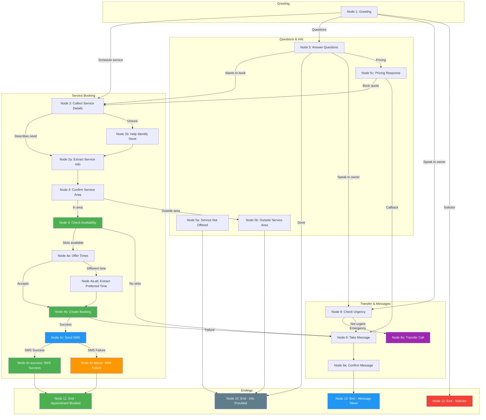

# Retell AI Incoming Call Flow for Business Customers

## Agent Overview
- **Agent Type**: Inbound Phone Agent (Customer Service)
- **Purpose**: Handle incoming calls for businesses that sign up with GreenLine AI
- **Use Case**: 24/7 AI phone answering for home service businesses
- **Cost**: $0.095/min

---

## What This Agent Does

When a homeowner calls a GreenLine AI customer's business phone number, this AI agent:
1. Answers professionally as the business
2. Handles common inquiries (services, hours, pricing ranges)
3. Books appointments on the business's calendar
4. Takes messages for urgent or complex requests
5. Qualifies leads before transferring to the business owner

---

## Node Components Used

| Node Type | Purpose | Content Mode |
|-----------|---------|--------------|
| **Conversation** | Main dialogue nodes | Prompt OR Static |
| **Extract Variable** | Capture caller information | N/A |
| **Function** | Cal.com booking, custom functions | N/A |
| **SMS** | Send confirmation texts | Static |
| **Call Transfer** | Transfer to business owner | Static |
| **Ending** | End call with disposition | Prompt OR Static |

---

## Dynamic Variables (Passed per Business)

These variables are configured per-business when they sign up:

| Variable Name | Description | Example |
|---------------|-------------|---------|
| `company_name` | Business name to use in greeting | "Mike's Plumbing" |
| `company_services` | List of services offered | "plumbing, drain cleaning, water heater repair" |
| `company_service_area` | Areas served | "San Diego and surrounding areas" |
| `company_hours` | Business hours | "Monday through Friday, 8am to 6pm" |
| `company_emergency` | Emergency availability | "24/7 for emergencies" |
| `owner_name` | Business owner name | "Mike" |
| `owner_phone` | Number to transfer urgent calls | "+1234567890" |
| `booking_enabled` | Whether to offer appointment booking | true/false |
| `cal_event_type_id` | Cal.com event type for bookings | "abc123" |

---

## Complete Call Flow

```
                        ┌─────────────────────────────────────────┐
                        │           INCOMING CALL FLOW             │
                        └─────────────────────────────────────────┘
                                          │
                                          ▼
                              ┌───────────────────────┐
                              │  Node 1: Greeting     │
                              └───────────────────────┘
                                          │
                      ┌───────────────────┼───────────────────┐
                      ▼                   ▼                   ▼
            ┌─────────────────┐ ┌─────────────────┐ ┌─────────────────┐
            │ Schedule Service│ │ Get Information │ │ Speak to Owner  │
            └─────────────────┘ └─────────────────┘ └─────────────────┘
                      │                   │                   │
                      ▼                   ▼                   ▼
            ┌─────────────────┐ ┌─────────────────┐ ┌─────────────────┐
            │ Collect Details │ │ Answer Questions│ │ Check Urgency   │
            └─────────────────┘ └─────────────────┘ └─────────────────┘
                      │                   │                   │
                      ▼                   │         ┌────────┴────────┐
            ┌─────────────────┐           │         ▼                 ▼
            │ Book Appointment│           │   ┌───────────┐    ┌───────────┐
            └─────────────────┘           │   │ Transfer  │    │ Take Msg  │
                      │                   │   └───────────┘    └───────────┘
                      ▼                   │         │                 │
            ┌─────────────────┐           │         │                 │
            │ Send Confirm SMS│           │         │                 │
            └─────────────────┘           │         │                 │
                      │                   │         │                 │
                      └───────────────────┴─────────┴─────────────────┘
                                          │
                                          ▼
                              ┌───────────────────────┐
                              │     End Call          │
                              └───────────────────────┘
```

---

### Node 1: Greeting
**Node Type**: Conversation
**Content Mode**: Prompt

**Content**:
```
Thank you for calling {{company_name}}! This is our AI assistant.
I can help you schedule a service appointment, answer questions about our services,
or connect you with {{owner_name}} if needed.

How can I help you today?
```

#### Transition
| Condition | Next Node | Type |
|-----------|-----------|------|
| Caller wants to schedule/book service | → Node 2: Collect Service Details | Prompt |
| Caller has questions about services/pricing/hours | → Node 5: Answer Questions | Prompt |
| Caller wants to speak to owner/human | → Node 8: Check Urgency | Prompt |
| Caller has emergency/urgent issue | → Node 8: Check Urgency | Prompt |
| Caller is a solicitor/spam | → Node 12: End - Solicitor | Prompt |

---

### Node 2: Collect Service Details
**Node Type**: Conversation
**Content Mode**: Prompt

**Content**:
```
I'd be happy to help you schedule a service appointment.

First, can you tell me what type of service you need? We offer {{company_services}}.
```

#### Transition
| Condition | Next Node | Type |
|-----------|-----------|------|
| Caller describes the service needed | → Node 2a: Extract Service Info | Prompt |
| Caller unsure what they need | → Node 2b: Help Identify Issue | Prompt |
| Service not offered | → Node 5a: Service Not Offered | Prompt |

---

### Node 2a: Extract Service Info
**Node Type**: Extract Variable

**Purpose**: Capture details about the service request.

#### Variables
| Variable Name | Description | Type |
|---------------|-------------|------|
| `service_type` | Type of service needed (e.g., "drain cleaning", "AC repair") | Text |
| `issue_description` | Brief description of the problem | Text |
| `urgency_level` | How urgent (today, this week, flexible) | Text |
| `caller_name` | Caller's name | Text |
| `caller_phone` | Callback number | Text |
| `service_address` | Address for service | Text |

#### Transition
| Condition | Next Node | Type |
|-----------|-----------|------|
| Details captured successfully | → Node 3: Confirm Service Area | Prompt |
| Need more information | → Node 2: Collect Service Details (loop back) | Prompt |

---

### Node 2b: Help Identify Issue
**Node Type**: Conversation
**Content Mode**: Prompt

**Content**:
```
No problem! Let me help you figure out what you need.

Can you describe what's happening? For example, is there a leak, something not working,
or are you looking for maintenance or installation?
```

#### Transition
| Condition | Next Node | Type |
|-----------|-----------|------|
| Caller describes issue | → Node 2a: Extract Service Info | Prompt |
| Still unclear | → Node 9: Take Message | Prompt |

---

### Node 3: Confirm Service Area
**Node Type**: Conversation
**Content Mode**: Prompt

**Content**:
```
Great! We handle {{service_type}} all the time.

Just to confirm - are you located in {{company_service_area}}?
```

#### Transition
| Condition | Next Node | Type |
|-----------|-----------|------|
| Yes, in service area | → Node 4: Check Availability (if booking_enabled) | Prompt |
| No, outside service area | → Node 5b: Outside Service Area | Prompt |

---

### Node 4: Check Availability (Function Node)
**Node Type**: Function
**Function**: `cal_com_check_availability`

**Purpose**: Check available appointment slots.

**Function Configuration**:
```json
{
  "function": "cal_com_check_availability",
  "parameters": {
    "event_type_id": "{{cal_event_type_id}}",
    "timezone": "America/Los_Angeles",
    "date_range": "next_7_days"
  }
}
```

#### Transition
| Condition | Next Node | Type |
|-----------|-----------|------|
| Slots available | → Node 4a: Offer Times | Prompt |
| No slots / API failure | → Node 9: Take Message | Prompt |

---

### Node 4a: Offer Times
**Node Type**: Conversation
**Content Mode**: Prompt

**Content**:
```
I can see we have availability. Would {{next_available}} work for you?
Or I can check other times if that doesn't fit your schedule.
```

#### Transition
| Condition | Next Node | Type |
|-----------|-----------|------|
| Accepts offered time | → Node 4b: Create Booking | Prompt |
| Requests different time | → Node 4a-alt: Extract Preferred Time | Prompt |
| Wants to speak to owner instead | → Node 8: Check Urgency | Prompt |

---

### Node 4a-alt: Extract Preferred Time
**Node Type**: Extract Variable

#### Variables
| Variable Name | Description | Type |
|---------------|-------------|------|
| `preferred_time` | When caller wants appointment | Text |

#### Transition
| Condition | Next Node | Type |
|-----------|-----------|------|
| Time extracted | → Node 4b: Create Booking | Prompt |
| Unable to find matching time | → Node 9: Take Message | Prompt |

---

### Node 4b: Create Booking (Function Node)
**Node Type**: Function
**Function**: `cal_com_create_booking`

**Function Configuration**:
```json
{
  "function": "cal_com_create_booking",
  "parameters": {
    "event_type_id": "{{cal_event_type_id}}",
    "attendee_name": "{{caller_name}}",
    "attendee_phone": "{{caller_phone}}",
    "start_time": "{{selected_time}}",
    "timezone": "America/Los_Angeles",
    "notes": "Service: {{service_type}}. Issue: {{issue_description}}"
  }
}
```

#### Transition
| Condition | Next Node | Type |
|-----------|-----------|------|
| Booking successful | → Node 4c: Send Confirmation SMS | Prompt |
| Booking failed | → Node 9: Take Message | Prompt |

---

### Node 4c: Send Confirmation SMS
**Node Type**: SMS

**SMS Content**:
```
Hi {{caller_name}}! Your appointment with {{company_name}} is confirmed for {{confirmed_time}}.

Service: {{service_type}}
Address: {{service_address}}

We'll see you then! Reply to this text if you need to reschedule.
```

#### SMS Transitions
| Transition | Next Node |
|------------|-----------|
| **Success** | → Node 4c-success: SMS Success |
| **Failure** | → Node 4c-failure: SMS Failure |

---

### Node 4c-success: SMS Success
**Node Type**: Conversation
**Content Mode**: Static

**Content**:
```
I just sent you a confirmation text with all the details.
Is there anything else I can help you with today?
```

#### Transition
| Condition | Next Node | Type |
|-----------|-----------|------|
| No, all set | → Node 11: End - Appointment Booked | Prompt |
| Has another question | → Node 5: Answer Questions | Prompt |

---

### Node 4c-failure: SMS Failure
**Node Type**: Conversation
**Content Mode**: Static

**Content**:
```
I had trouble sending the text, but you're all booked!
Your appointment is set for {{confirmed_time}} for {{service_type}}.
{{company_name}} will see you then.

Is there anything else I can help you with?
```

#### Transition
| Condition | Next Node | Type |
|-----------|-----------|------|
| No, all set | → Node 11: End - Appointment Booked | Prompt |
| Has another question | → Node 5: Answer Questions | Prompt |

---

### Node 5: Answer Questions
**Node Type**: Conversation
**Content Mode**: Prompt

**Content**:
```
Of course! I'm happy to help with any questions.

Here's what I can tell you about {{company_name}}:

**Services we offer**: {{company_services}}
**Service area**: {{company_service_area}}
**Hours**: {{company_hours}}
**Emergencies**: {{company_emergency}}

What would you like to know more about?
```

#### Transition
| Condition | Next Node | Type |
|-----------|-----------|------|
| Question answered, wants to book | → Node 2: Collect Service Details | Prompt |
| Question answered, done | → Node 10: End - Info Provided | Prompt |
| Wants to speak to owner | → Node 8: Check Urgency | Prompt |
| Has pricing question | → Node 5c: Pricing Response | Prompt |

---

### Node 5a: Service Not Offered
**Node Type**: Conversation
**Content Mode**: Prompt

**Content**:
```
I apologize, but {{company_name}} doesn't offer that particular service.

Our specialties are {{company_services}}.

Is there something else I can help you with today?
```

#### Transition
| Condition | Next Node | Type |
|-----------|-----------|------|
| Caller has different need we can help | → Node 2: Collect Service Details | Prompt |
| Caller done | → Node 10: End - Info Provided | Prompt |

---

### Node 5b: Outside Service Area
**Node Type**: Conversation
**Content Mode**: Static

**Content**:
```
I'm sorry, but that location is outside our current service area.
We primarily serve {{company_service_area}}.

Is there anything else I can help you with?
```

#### Transition
| Condition | Next Node | Type |
|-----------|-----------|------|
| Done | → Node 10: End - Info Provided | Prompt |
| Wants to check closer location | → Continue conversation | Prompt |

---

### Node 5c: Pricing Response
**Node Type**: Conversation
**Content Mode**: Prompt

**Content**:
```
Great question! Pricing for {{service_type}} can vary depending on the specific situation.

For an accurate quote, I'd recommend scheduling a quick evaluation appointment,
or I can have {{owner_name}} give you a call back to discuss pricing.

Which would work better for you?
```

#### Transition
| Condition | Next Node | Type |
|-----------|-----------|------|
| Wants appointment for quote | → Node 2: Collect Service Details | Prompt |
| Wants callback | → Node 9: Take Message | Prompt |
| Done for now | → Node 10: End - Info Provided | Prompt |

---

### Node 8: Check Urgency
**Node Type**: Conversation
**Content Mode**: Prompt

**Content**:
```
I understand you'd like to speak with {{owner_name}} directly.

Is this an emergency situation that needs immediate attention,
or would you prefer a callback when {{owner_name}} is available?
```

#### Transition
| Condition | Next Node | Type |
|-----------|-----------|------|
| Emergency - needs immediate help | → Node 8a: Transfer Call | Prompt |
| Not urgent - callback is fine | → Node 9: Take Message | Prompt |
| Just had a quick question | → Node 5: Answer Questions | Prompt |

---

### Node 8a: Transfer Call
**Node Type**: Call Transfer
**Content Mode**: Static

**Transfer To**: `{{owner_phone}}`

**Content**:
```
I'm going to transfer you to {{owner_name}} right now.
Please hold for just a moment.
```

#### Transition
| Condition | Next Node | Type |
|-----------|-----------|------|
| Transfer successful | → End Call | — |
| Transfer failed | → Node 9: Take Message | Prompt |

---

### Node 9: Take Message
**Node Type**: Extract Variable

**Purpose**: Capture message details from the caller for business owner follow-up.

#### Variables
| Variable Name | Description | Type |
|---------------|-------------|------|
| `message_name` | Caller's name | Text |
| `message_phone` | Callback number | Text |
| `message_reason` | Reason for call/message | Text |
| `callback_preference` | Best time to call back | Text |

#### Transition
| Condition | Next Node | Type |
|-----------|-----------|------|
| Message captured | → Node 9a: Confirm Message | Prompt |

---

### Node 9a: Confirm Message
**Node Type**: Conversation
**Content Mode**: Prompt

**Content**:
```
I've got it. Let me confirm:

Name: {{message_name}}
Callback number: {{message_phone}}
Regarding: {{message_reason}}

I'll make sure {{owner_name}} gets this message and calls you back as soon as possible.
Is there anything else you'd like me to add?
```

#### Transition
| Condition | Next Node | Type |
|-----------|-----------|------|
| Message confirmed | → Node 13: End - Message Taken | Prompt |
| Needs correction | → Node 9: Take Message (loop) | Prompt |

---

## Ending Nodes

### Node 10: End - Info Provided
**Node Type**: Ending
**Content Mode**: Static
**Disposition**: Info Provided

**Content**:
```
You're welcome! Thanks for calling {{company_name}}.
If you need anything else, don't hesitate to call back.
Have a great day!
```

---

### Node 11: End - Appointment Booked
**Node Type**: Ending
**Content Mode**: Prompt
**Disposition**: Appointment Booked

**Content**:
```
Your appointment is all set for {{confirmed_time}}.
Thanks for choosing {{company_name}}!
We look forward to helping you with your {{service_type}} needs.
Have a great day!
```

---

### Node 12: End - Solicitor
**Node Type**: Ending
**Content Mode**: Static
**Disposition**: Solicitor/Spam

**Content**:
```
I'm sorry, but we're not interested at this time.
Please remove this number from your calling list.
Thank you, goodbye.
```

---

### Node 13: End - Message Taken
**Node Type**: Ending
**Content Mode**: Prompt
**Disposition**: Message Taken

**Content**:
```
I'll make sure {{owner_name}} gets your message right away.
Thanks for calling {{company_name}}, and have a wonderful day!
```

---

## Call Dispositions Summary

| Disposition | When to Use | Follow-up Action |
|-------------|-------------|------------------|
| **Appointment Booked** | Service appointment scheduled | Send to business calendar |
| **Message Taken** | Caller left message for owner | Notify owner immediately |
| **Info Provided** | Caller had questions answered | Log interaction |
| **Transfer Completed** | Call transferred to owner | Track in call log |
| **Solicitor/Spam** | Sales call or spam | No follow-up |
| **Outside Service Area** | Location not served | Log for future expansion |

---

## Integration Notes

### Per-Business Configuration

Each business that signs up needs:
1. Custom agent created in Retell dashboard
2. Dynamic variables configured:
   - Company name, services, hours
   - Cal.com integration (if booking enabled)
   - Owner transfer number
3. Phone number assigned via Twilio
4. Webhook configured for call logging

### API Integration

Calls are logged to Supabase via webhook:
```typescript
// /api/calls/webhook.ts handles incoming call events
{
  call_type: "inbound",
  business_id: "...",
  caller_phone: "...",
  disposition: "Appointment Booked",
  duration: 180,
  transcript: "..."
}
```

---

## Flow Diagram (Mermaid)



---

## Implementation Checklist

- [ ] Create inbound agent template in Retell dashboard
- [ ] Configure per-business variable structure
- [ ] Set up Cal.com integration for appointment booking
- [ ] Configure call transfer functionality
- [ ] Set up SMS sending capability
- [ ] Create webhook handler for inbound calls
- [ ] Build business onboarding flow to capture configuration
- [ ] Test full flow with sample business
- [ ] Deploy and monitor
