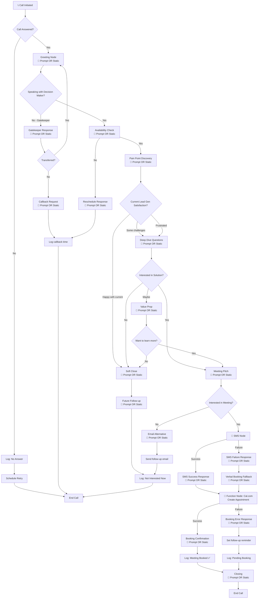

# GreenLine AI Voice Agent Flow

This document outlines the conversation flow for the Retell AI voice agent used in the GreenLine AI auto-dialer system.

## Flow Chart



## Node Configuration

Each conversation node in the flow supports two content modes:

| Mode | Description | Use Case |
|------|-------------|----------|
| **Prompt** | AI generates dynamic response based on context | When personalization or situational awareness is needed |
| **Static Sentence** | Pre-defined text spoken exactly as written | For consistent messaging, compliance, or specific scripts |

### Configuration Example

```json
{
  "node_id": "greeting",
  "content_mode": "prompt",  // or "static"
  "prompt": "Introduce yourself warmly and ask if now is a good time to talk briefly about their lead generation.",
  "static_text": "Hi, this is Alex from GreenLine AI. Do you have a quick moment to chat?"
}
```

## Conversation States

### 1. Initial Greeting
- Introduce as Alex from GreenLine AI
- Be warm and professional
- Immediately ask if it's a good time
- **Mode:** Prompt OR Static

### 2. Gatekeeper Handling
- Politely ask to speak with the owner or decision maker
- If unavailable, get best callback time
- Never pitch to gatekeepers
- **Mode:** Prompt OR Static

### 3. Pain Point Discovery
Key questions to ask:
- "How are you currently getting new leads for your business?"
- "Are you happy with the quality and volume of leads you're getting?"
- "What would it mean for your business if you could 2-3x your qualified leads?"
- **Mode:** Prompt OR Static

### 4. Value Proposition
- We help home services businesses generate more qualified leads
- AI-powered outreach that works 24/7
- Clients typically see 2-3x increase in qualified leads
- **Mode:** Prompt OR Static

### 5. SMS Node
Sends booking link via SMS to the lead's phone number.

| Transition | Response Node |
|------------|---------------|
| **Success** | SMS Success Response (Prompt OR Static) - e.g., "Great, I just sent you a link to book directly." |
| **Failure** | SMS Failure Response (Prompt OR Static) - e.g., "I wasn't able to send the link, but let me help you book right now." |

### 6. Meeting Booking (Function Node: Cal.com)
Uses the built-in Cal.com function node to create appointments directly:

```json
{
  "node_type": "function",
  "function": "cal_com_create_booking",
  "parameters": {
    "event_type_id": "your-event-type-id",
    "attendee_name": "{{lead_name}}",
    "attendee_email": "{{lead_email}}",
    "attendee_phone": "{{lead_phone}}",
    "start_time": "{{selected_time}}"
  }
}
```

| Transition | Response Node |
|------------|---------------|
| **Success** | Booking Confirmation (Prompt OR Static) - Confirms meeting details |
| **Failure** | Booking Error Response (Prompt OR Static) - Offers to follow up or retry |

### 7. Objection Handling

| Objection | Response |
|-----------|----------|
| "Not interested" | "I understand. Would it be okay if I followed up in a few months to see if anything has changed?" |
| "Already have a marketing agency" | "That's great! How are they doing with lead generation specifically? Many of our clients use us alongside their agency." |
| "Too busy right now" | "I completely understand. When would be a better time for a quick 5-minute chat?" |
| "How much does it cost?" | "It varies based on your goals. That's exactly what we'd cover in the strategy call - no pressure, just to see if we're a fit." |

## Call Outcomes

| Status | Description | Next Action |
|--------|-------------|-------------|
| `meeting_booked` | Successfully scheduled meeting | Send confirmation email |
| `callback_scheduled` | Will call back at specific time | Add to callback queue |
| `not_interested` | Declined, no follow-up | Archive lead |
| `not_interested_now` | Declined but open to future | Schedule 3-month follow-up |
| `no_answer` | Call not answered | Retry up to 3 times |
| `wrong_number` | Invalid phone number | Remove from list |
| `voicemail` | Left voicemail | Schedule callback |

## Technical Integration

### Retell AI Configuration
- **Agent ID**: Configured in `wrangler.toml` as `RETELL_AGENT_ID_1`
- **From Number**: Twilio number configured as `RETELL_FROM_NUMBER`
- **Webhook URL**: `https://greenlineai-frontend.pages.dev/api/calls/webhook`

### Dynamic Variables
The agent receives these variables for personalization:
```json
{
  "business_context": "Custom prompt or default sales script",
  "lead_name": "Contact name from database",
  "business_name": "Company name",
  "industry": "Business type (e.g., HVAC, Plumbing)"
}
```

### Cal.com Function Node Integration
Uses the built-in Retell function node to create appointments via Cal.com API:

| Parameter | Description |
|-----------|-------------|
| `event_type_id` | Your Cal.com event type ID |
| `attendee_name` | Lead's name (from dynamic variables) |
| `attendee_email` | Lead's email address |
| `attendee_phone` | Lead's phone number |
| `start_time` | Selected appointment time (ISO 8601) |

**Transitions:**
- **Success**: Proceeds to booking confirmation node
- **Failure**: Routes to error handling with follow-up reminder

### SMS Node Integration
Sends booking link via Twilio SMS:

| Transition | Description |
|------------|-------------|
| **Success** | SMS delivered - proceed to confirmation response |
| **Failure** | SMS failed - route to verbal booking fallback |

Each transition can be configured with either a **Prompt** (AI-generated response) or **Static Sentence** (pre-defined text).
