# GreenLine AI Voice Agent Flow

This document outlines the conversation flow for the Retell AI voice agent used in the GreenLine AI auto-dialer system.

## Flow Chart

```mermaid
flowchart TD
    A[📞 Call Initiated] --> B{Call Answered?}
    B -->|No| C[Log: No Answer]
    C --> D[Schedule Retry]
    D --> E[End Call]

    B -->|Yes| F[Greeting: Hi, this is Alex from GreenLine AI]

    F --> G{Speaking with Decision Maker?}
    G -->|No - Gatekeeper| H[Ask to speak with owner/manager]
    H --> I{Transferred?}
    I -->|No| J[Ask for best time to call back]
    J --> K[Log callback time]
    K --> E
    I -->|Yes| F

    G -->|Yes| L[Is this a good time to talk?]
    L -->|No| M[When would be better?]
    M --> K

    L -->|Yes| N[Pain Point Discovery]
    N --> O{Current Lead Gen Satisfaction?}

    O -->|Happy with current| P[Acknowledge & soft close]
    P --> Q[Offer to follow up in future]
    Q --> R[Log: Not Interested Now]
    R --> E

    O -->|Some challenges| S[Dig deeper into pain points]
    S --> T{Interested in Solution?}

    O -->|Frustrated| S

    T -->|No| P
    T -->|Maybe| U[Share quick value prop]
    U --> V{Want to learn more?}

    T -->|Yes| W[Pitch: 15-min Strategy Call]

    V -->|No| P
    V -->|Yes| W

    W --> X{Interested in Meeting?}
    X -->|No| Y[Offer alternative: Email info]
    Y --> Z[Send follow-up email]
    Z --> R

    X -->|Yes| AA[Send Calendly Link via SMS]
    AA --> AB[Confirm they received it]
    AB --> AC{Booked?}
    AC -->|Yes| AD[Confirm meeting details]
    AD --> AE[Log: Meeting Booked ✅]
    AE --> AF[Thank & End Call]

    AC -->|Will book later| AG[Set follow-up reminder]
    AG --> AH[Log: Pending Booking]
    AH --> AF
```



## Conversation States

### 1. Initial Greeting
- Introduce as Alex from GreenLine AI
- Be warm and professional
- Immediately ask if it's a good time

### 2. Gatekeeper Handling
- Politely ask to speak with the owner or decision maker
- If unavailable, get best callback time
- Never pitch to gatekeepers

### 3. Pain Point Discovery
Key questions to ask:
- "How are you currently getting new leads for your business?"
- "Are you happy with the quality and volume of leads you're getting?"
- "What would it mean for your business if you could 2-3x your qualified leads?"

### 4. Value Proposition
- We help home services businesses generate more qualified leads
- AI-powered outreach that works 24/7
- Clients typically see 2-3x increase in qualified leads

### 5. Meeting Booking
- Offer a brief 15-minute strategy call
- Send Calendly link via SMS: `https://calendly.com/greenlineai`
- Confirm they received the link
- Verify booking before ending call

### 6. Objection Handling

| Objection | Response |
|-----------|----------|
| "Not interested" | "I understand. Would it be okay if I followed up in a few months to see if anything has changed?" |
| "Already have a marketing agency" | "That's great! How are they doing with lead generation specifically? Many of our clients use us alongside their agency." |
| "Too busy right now" | "I completely understand. When would be a better time for a quick 5-minute chat?" |
| "How much does it cost?" | "It varies based on your goals. That's exactly what we'd cover in the strategy call - no pressure, just to see if we're a fit." |

## Call Outcomes

| Status | Description | Next Action |
|--------|-------------|-------------|
| `meeting_booked` | Successfully scheduled meeting | Send confirmation email |
| `callback_scheduled` | Will call back at specific time | Add to callback queue |
| `not_interested` | Declined, no follow-up | Archive lead |
| `not_interested_now` | Declined but open to future | Schedule 3-month follow-up |
| `no_answer` | Call not answered | Retry up to 3 times |
| `wrong_number` | Invalid phone number | Remove from list |
| `voicemail` | Left voicemail | Schedule callback |

## Technical Integration

### Retell AI Configuration
- **Agent ID**: Configured in `wrangler.toml` as `RETELL_AGENT_ID_1`
- **From Number**: Twilio number configured as `RETELL_FROM_NUMBER`
- **Webhook URL**: `https://greenlineai-frontend.pages.dev/api/calls/webhook`

### Dynamic Variables
The agent receives these variables for personalization:
```json
{
  "business_context": "Custom prompt or default sales script",
  "lead_name": "Contact name from database",
  "business_name": "Company name",
  "industry": "Business type (e.g., HVAC, Plumbing)"
}
```

### Calendly Integration
- Link sent via SMS during call
- Webhook receives booking confirmation
- Automatically updates lead status in database
